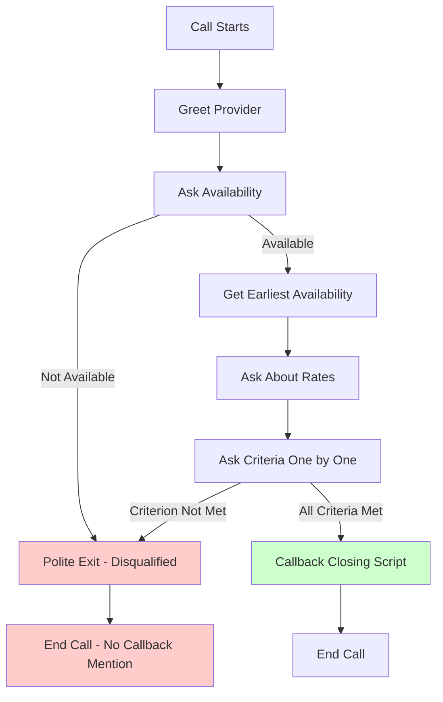

# VAPI Webhook Architecture Diagram

## Current Architecture (Polling - INEFFICIENT)

```
┌─────────────────────────────────────────────────────────────────┐
│ Kestra Workflow: contact_providers                             │
│                                                                 │
│  ┌────────────────────────────────────────────────────────┐    │
│  │ call-provider.js Script                                │    │
│  │                                                         │    │
│  │  1. Create VAPI call                                   │    │
│  │     │                                                   │    │
│  │     ▼                                                   │    │
│  │  2. Get call ID                                        │    │
│  │     │                                                   │    │
│  │     ▼                                                   │    │
│  │  3. POLL VAPI API every 5 seconds (max 60 times) ◄─┐  │    │
│  │     │                                               │  │    │
│  │     ├─► GET /calls/{id} ──► VAPI API              │  │    │
│  │     │                           │                   │  │    │
│  │     │                           ├─► status: ringing │  │    │
│  │     │                           └─► KEEP POLLING ───┘  │    │
│  │     │                                                   │    │
│  │     ▼                                                   │    │
│  │  4. Wait 5 seconds                                     │    │
│  │     │                                                   │    │
│  │     ▼                                                   │    │
│  │  5. Check again (attempt 2/60)                        │    │
│  │     │                                                   │    │
│  │     ▼                                                   │    │
│  │  6. ... repeat until status='ended' or timeout        │    │
│  │     │                                                   │    │
│  │     ▼                                                   │    │
│  │  7. Return result or timeout error                    │    │
│  └────────────────────────────────────────────────────────┘    │
│                                                                 │
└─────────────────────────────────────────────────────────────────┘

PROBLEMS:
❌ Makes 60+ API calls to VAPI
❌ 5-second delay between checks
❌ Can timeout on long calls
❌ Wastes resources
```

---

## New Architecture (Webhook + Cache - EFFICIENT)

**Current Implementation: In-Memory Cache**

- Fast, low-latency lookups (< 10ms)
- 30-minute TTL with automatic cleanup
- No external dependencies
- Future: Redis for multi-instance scaling

```
┌──────────────────────────────────────────────────────────────────────────────┐
│                         VAPI WEBHOOK FLOW                                    │
└──────────────────────────────────────────────────────────────────────────────┘

STEP 1: Kestra initiates call
┌─────────────────────────┐
│ Kestra Workflow         │
│                         │
│  call-provider.js       │
│  - Create VAPI call     │
│  - Get call ID          │
│  - Return immediately ✓ │
└───────────┬─────────────┘
            │
            ▼
     ┌──────────────┐
     │  VAPI API    │
     │              │
     │  Call starts │
     │  Status: in- │
     │  progress    │
     └──────┬───────┘
            │
            │ Call in progress...
            │ (30 seconds to 5 minutes)
            │
            ▼
    ┌───────────────────┐
    │ Call completes    │
    │ Status: ended     │
    └─────────┬─────────┘
              │
              │
              ▼
┌─────────────────────────────────────────────────────────────────┐
│ STEP 2: VAPI sends webhook                                     │
│                                                                 │
│  POST /api/v1/vapi/webhooks/vapi                               │
│  {                                                              │
│    "message": {                                                 │
│      "type": "end-of-call-report",                             │
│      "call": {                                                  │
│        "id": "abc123",                                          │
│        "status": "ended",                                       │
│        "transcript": "...",                                     │
│        "analysis": { ... }                                      │
│      }                                                          │
│    }                                                            │
│  }                                                              │
└────────────────────────┬────────────────────────────────────────┘
                         │
                         ▼
              ┌─────────────────────────┐
              │ API Server              │
              │ (Fastify)               │
              │                         │
              │ 1. Verify signature*    │
              │ 2. Validate payload     │
              │ 3. Store in cache       │
              └───────────┬─────────────┘
                          │
                          ▼
                 ┌──────────────────────────────────┐
                 │ In-Memory Cache                  │
                 │ (WebhookCacheService)            │
                 │                                  │
                 │ Map<callId, CallResult>          │
                 │ ┌──────────────────────────────┐ │
                 │ │ call_id: abc123              │ │
                 │ │ status: completed            │ │
                 │ │ transcript: {...}            │ │
                 │ │ analysis: {...}              │ │
                 │ │ TTL: 30 minutes              │ │
                 │ └──────────────────────────────┘ │
                 └──────────────┬───────────────────┘
                                │
                                │
                                ▼
┌─────────────────────────────────────────────────────────────────┐
│ STEP 3: Kestra retrieves result                                │
│                                                                 │
│  Lightweight cache poll:                                       │
│  GET /api/v1/vapi/calls/{call_id}                              │
│                                                                 │
│  ┌────────────────────────────────────┐                        │
│  │ webhookCache.get(call_id)          │                        │
│  │ → Returns CallResult if cached     │                        │
│  │ → Returns 404 if not ready         │                        │
│  └────────────────────────────────────┘                        │
│                                                                 │
│  Returns immediately if available ✓                            │
│  Or polls every 5 seconds (fast in-memory lookup)              │
└─────────────────────────────────────────────────────────────────┘

* Signature verification: Future enhancement (currently optional)

BENEFITS:
✅ Zero calls to VAPI API after initial call creation
✅ Real-time results via webhook (no delay)
✅ No timeout issues
✅ In-memory cache is extremely fast (< 10ms lookups)
✅ Kestra polling is lightweight (no external API or DB)
✅ 30-minute TTL with automatic cleanup
✅ AI-powered disqualification detection during calls
✅ Conditional closing scripts based on qualification status
```

---

## DirectVapiClient Hybrid Architecture (December 2025)

The `DirectVapiClient` now supports **hybrid mode** for optimal performance when `VAPI_WEBHOOK_URL` is configured:

```
┌──────────────────────────────────────────────────────────────────────────────┐
│                     DIRECTVAPICLIENT HYBRID FLOW                              │
└──────────────────────────────────────────────────────────────────────────────┘

STEP 1: Create VAPI call with webhook configuration
┌─────────────────────────────────────────────────────────────┐
│ DirectVapiClient                                             │
│                                                              │
│  // Uses shared webhook-config.ts (DRY principle)            │
│  import { createWebhookAssistantConfig,                      │
│           createWebhookMetadata } from "./webhook-config.js" │
│                                                              │
│  if (this.webhookUrl) {                                      │
│    // Uses assistant.server.url (not callParams.serverUrl)   │
│    callParams.assistant = createWebhookAssistantConfig(      │
│      request, this.webhookUrl                                │
│    );                                                        │
│    callParams.metadata = createWebhookMetadata(request);     │
│  }                                                           │
└───────────┬─────────────────────────────────────────────────┘
            │
            ▼
     ┌──────────────┐
     │  VAPI API    │
     │              │
     │  Call starts │
     │  with webhook│
     │  configured  │
     └──────┬───────┘
            │
            │ Call in progress...
            │
            ▼
    ┌───────────────────┐
    │ Call completes    │
    │ Status: ended     │
    └─────────┬─────────┘
              │
              ▼
┌─────────────────────────────────────────────────────────────────┐
│ STEP 2: VAPI sends webhook with metadata                        │
│                                                                 │
│  POST /api/v1/vapi/webhook                                      │
│  {                                                              │
│    "message": {                                                 │
│      "type": "end-of-call-report",                             │
│      "metadata": { serviceRequestId, providerId, ... },        │
│      "call": { id, transcript, analysis, ... }                 │
│    }                                                            │
│  }                                                              │
└────────────────────────┬────────────────────────────────────────┘
                         │
                         ▼
              ┌─────────────────────────┐
              │ API Server              │
              │ (Fastify)               │
              │                         │
              │ 1. Store in cache       │
              │ 2. Enrich with metadata │
              │ 3. Persist to database  │
              │ 4. Set dataStatus:      │
              │    'complete'           │
              └───────────┬─────────────┘
                          │
                          ▼
                 ┌──────────────────────────────────┐
                 │ In-Memory Cache                  │
                 │ (WebhookCacheService)            │
                 │                                  │
                 │ Map<callId, CallResult>          │
                 │ ┌──────────────────────────────┐ │
                 │ │ call_id: abc123              │ │
                 │ │ dataStatus: 'complete'       │ │
                 │ │ transcript: {...}            │ │
                 │ │ analysis: {...}              │ │
                 │ │ TTL: 30 minutes              │ │
                 │ └──────────────────────────────┘ │
                 └──────────────┬───────────────────┘
                                │
                                │
                                ▼
┌─────────────────────────────────────────────────────────────────┐
│ STEP 3: DirectVapiClient polls backend cache                    │
│                                                                 │
│  waitForWebhookResult(callId):                                  │
│    while (elapsed < 5 minutes) {                               │
│      response = fetch(`${BACKEND_URL}/api/v1/vapi/calls/${id}`)│
│      if (response.data.dataStatus === 'complete') {            │
│        return response.data; // Fast path!                     │
│      }                                                          │
│      await sleep(2000); // Poll every 2s                       │
│    }                                                            │
│    return null; // Timeout - fall back to VAPI polling         │
│                                                                 │
│  Returns CallResult in <500ms if webhook received ✓             │
└─────────────────────────────────────────────────────────────────┘

FALLBACK (if webhook times out):
┌─────────────────────────────────────────────────────────────────┐
│ STEP 4: Fall back to VAPI API polling                          │
│                                                                 │
│  pollCallCompletion(callId):                                   │
│    while (attempts < 60) { // Max 5 minutes                    │
│      call = await vapi.calls.get(callId);                      │
│      if (call.status === 'ended') {                            │
│        return formatCallResult(call);                          │
│      }                                                          │
│      await sleep(5000); // Poll every 5s                       │
│    }                                                            │
│                                                                 │
│  Original behavior preserved as fallback                        │
└─────────────────────────────────────────────────────────────────┘

HYBRID MODE BENEFITS:
✅ 31x fewer VAPI API calls when webhook works
✅ <500ms latency vs 2.5s average with polling
✅ Automatic database persistence via webhook infrastructure
✅ Graceful fallback to polling if webhook unavailable
✅ Works in any environment (local dev without ngrok uses polling)
✅ Metadata linking enables database enrichment
```

### Configuration

```bash
# Enable hybrid mode (production/ngrok environments)
VAPI_WEBHOOK_URL=https://your-domain.com/api/v1/vapi/webhook
BACKEND_URL=https://your-domain.com  # or http://localhost:8000 for local

# Disable hybrid mode (local dev without ngrok)
# Simply leave VAPI_WEBHOOK_URL unset
```

### Key Implementation Details

1. **webhook-config.ts**: Shared configuration service for webhook-enabled calls (DRY principle)
2. **assistant.server.url**: VAPI SDK v0.11.0+ requires webhook URL in assistant config, not call params
3. **createWebhookAssistantConfig()**: Wraps base assistant config with server URL and timeout settings
4. **createWebhookMetadata()**: Creates metadata object that travels with VAPI webhook callbacks
5. **dataStatus**: Cache field indicating 'partial' (webhook received) or 'complete' (enriched)
6. **waitForWebhookResult()**: Polls backend cache every 2s for up to 5 minutes
7. **Fallback**: If webhook times out, falls back to original VAPI polling behavior

**SDK Deprecation Note**: VAPI SDK v0.11.0 deprecated `callParams.serverUrl`. Use `assistant.server.url` via `createWebhookAssistantConfig()` instead.

---

## Call Flow with Disqualification Logic

The VAPI assistant actively detects disqualification during calls and adjusts its behavior accordingly:



### Disqualification Detection

During the call, the assistant watches for responses that disqualify the provider:

- Provider says they don't have anyone available
- Provider can't meet a specific requirement
- Provider explicitly states they don't do the type of work needed
- Rate is significantly higher than reasonable

### Conditional Closing Logic

The assistant uses different closing scripts based on qualification status:

**If ALL criteria met (qualified):**

```
"Perfect, thank you so much for all that information! Once I confirm with
my client, if they decide to proceed, I'll call you back to schedule.
Does that sound good?"
```

**If disqualified:**

```
"Thank you so much for taking the time to chat. Unfortunately, it sounds
like this particular request might not be the best fit right now, but I
really appreciate your help. Have a wonderful day!"
```

Note: The disqualified script intentionally avoids mentioning scheduling or callbacks.

### Structured Data Schema

The analysis includes disqualification tracking and earliest availability:

```json
{
  "availability": "available" | "unavailable" | "callback_requested" | "unclear",
  "earliest_availability": "Tomorrow at 2pm",
  "estimated_rate": "$85/hour",
  "single_person_found": true,
  "technician_name": "John",
  "all_criteria_met": false,
  "criteria_details": {
    "licensed": true,
    "years_experience": false
  },
  "disqualified": true,
  "disqualification_reason": "Cannot meet criterion: 10+ years experience",
  "call_outcome": "negative",
  "recommended": false,
  "notes": "Provider only has 5 years experience"
}
```

Key fields:

- **earliest_availability**: Specific date/time when provider can come (e.g., "Tomorrow at 2pm", "Friday morning")
- **disqualified**: Boolean flag indicating if provider cannot meet requirements
- **disqualification_reason**: Explanation of why provider was disqualified
- **criteria_details**: Breakdown of which specific criteria were met or not met

---

## Detailed Component Diagram

```
┌───────────────────────────────────────────────────────────────────────────────┐
│                              COMPONENTS                                       │
└───────────────────────────────────────────────────────────────────────────────┘

┌─────────────────────┐
│ Kestra Workflow     │
│ (orchestration)     │
│                     │
│ 1. call-provider.js │◄─── Triggers VAPI call, gets call_id
│    └─► VAPI API     │
│                     │
│ 2. poll-results.sh  │◄─── Polls API server for results
│    └─► API Server   │
└─────────────────────┘
         │
         │ HTTP
         │
         ▼
┌─────────────────────────────────────────────────────────────┐
│ API Server (Fastify 5, Port 8000)                          │
│                                                             │
│  ┌─────────────────────────────────────────────────────┐   │
│  │ /apps/api/src/routes/vapi.ts                        │   │
│  │                                                      │   │
│  │  POST /webhooks/vapi ──┐                           │   │
│  │  GET  /calls/:callId   │  Request Handlers          │   │
│  │  GET  /calls/by-phone  │                           │   │
│  └────────────────┬───────────────────────────────────┘   │
│                   │                                        │
│                   │ calls                                  │
│                   ▼                                        │
│  ┌─────────────────────────────────────────────────────┐   │
│  │ /apps/api/src/services/vapi.ts                      │   │
│  │                                                      │   │
│  │  storeCallResult()                                  │   │
│  │  getCallResult()                                    │   │
│  │  getCallResultsByPhone()                           │   │
│  │  waitForCallCompletion()                           │   │
│  └────────────────┬───────────────────────────────────┘   │
│                   │                                        │
│                   │ uses                                   │
│                   ▼                                        │
│  ┌─────────────────────────────────────────────────────┐   │
│  │ request.supabase (plugin)                           │   │
│  │                                                      │   │
│  │  - Database queries                                 │   │
│  │  - RLS enforcement                                  │   │
│  └────────────────┬───────────────────────────────────┘   │
└────────────────────┼──────────────────────────────────────┘
                     │
                     │ SQL
                     ▼
┌─────────────────────────────────────────────────────────────┐
│ Supabase (PostgreSQL)                                      │
│                                                             │
│  ┌─────────────────────────────────────────────────────┐   │
│  │ vapi_call_results                                   │   │
│  │                                                      │   │
│  │ Columns:                                            │   │
│  │  - id (uuid)                                        │   │
│  │  - call_id (text, unique)                          │   │
│  │  - status (enum)                                    │   │
│  │  - customer_phone (text)                           │   │
│  │  - transcript (jsonb)                              │   │
│  │  - analysis_summary (text)                         │   │
│  │  - analysis_structured_data (jsonb)               │   │
│  │  - provider_name, service_type, etc.              │   │
│  │  - raw_webhook_payload (jsonb)                    │   │
│  │  - created_at, updated_at                          │   │
│  │                                                      │   │
│  │ Indexes:                                            │   │
│  │  - call_id (unique)                                │   │
│  │  - status                                           │   │
│  │  - customer_phone                                   │   │
│  │  - created_at                                       │   │
│  └─────────────────────────────────────────────────────┘   │
│                                                             │
│  RLS Policies:                                             │
│  - Service role: full access                               │
│  - Users: view their own calls (via service_requests)     │
└─────────────────────────────────────────────────────────────┘
```

---

## Webhook Sequence Diagram

```
VAPI          API Server       Database       Kestra
 │                │               │              │
 │  Call starts   │               │              │
 ├───────────────►│               │              │
 │  (initiated    │               │              │
 │   by Kestra)   │               │              │
 │                │               │              │
 │  ... call in progress ...      │              │
 │                │               │              │
 │  Call ends     │               │              │
 │  (status:      │               │              │
 │   'ended')     │               │              │
 │                │               │              │
 │  POST webhook  │               │              │
 ├───────────────►│               │              │
 │                │               │              │
 │                │  Verify sig   │              │
 │                ├─────────┐     │              │
 │                │         │     │              │
 │                │◄────────┘     │              │
 │                │               │              │
 │                │  Validate     │              │
 │                ├─────────┐     │              │
 │                │         │     │              │
 │                │◄────────┘     │              │
 │                │               │              │
 │                │  UPSERT       │              │
 │                ├──────────────►│              │
 │                │               │              │
 │                │  Success      │              │
 │                │◄──────────────┤              │
 │                │               │              │
 │   200 OK       │               │              │
 │◄───────────────┤               │              │
 │                │               │              │
 │                │               │  Poll for    │
 │                │               │  results     │
 │                │  GET /calls/{id}             │
 │                │◄──────────────────────────────┤
 │                │               │              │
 │                │  Query DB     │              │
 │                ├──────────────►│              │
 │                │               │              │
 │                │  Result       │              │
 │                │◄──────────────┤              │
 │                │               │              │
 │                │  200 + data   │              │
 │                ├──────────────────────────────►│
 │                │               │              │
 │                │               │  Process     │
 │                │               │  results     │
 │                │               │              │
```

---

## File System Layout

```
concierge-ai/
│
├── apps/
│   ├── api/
│   │   ├── src/
│   │   │   ├── index.ts ──────────────────► Register vapi routes
│   │   │   ├── routes/
│   │   │   │   ├── gemini.ts ─────────────► Existing (reference)
│   │   │   │   ├── users.ts ──────────────► Existing (reference)
│   │   │   │   ├── workflows.ts ──────────► Existing (reference)
│   │   │   │   ├── vapi.ts ───────────────► Database operations (future)
│   │   │   │   └── vapi-webhook.ts ───────► ACTIVE: Webhook endpoints & cache
│   │   │   ├── services/
│   │   │   │   ├── gemini.ts ─────────────► Existing (reference)
│   │   │   │   └── vapi/
│   │   │   │       ├── types.ts ──────────► Shared types (CallRequest, CallResult)
│   │   │   │       ├── assistant-config.ts ► SOURCE OF TRUTH for base VAPI config
│   │   │   │       ├── webhook-config.ts ──► SOURCE OF TRUTH for webhook config
│   │   │   │       ├── webhook-cache.service.ts ► In-memory cache (30min TTL)
│   │   │   │       ├── direct-vapi.client.ts ► Direct VAPI client
│   │   │   │       ├── kestra.client.ts ──► Kestra integration
│   │   │   │       ├── provider-calling.service.ts ► Main orchestrator
│   │   │   │       └── index.ts ──────────► Service exports
│   │   │   ├── lib/
│   │   │   │   ├── supabase.ts ───────────► Existing (reference)
│   │   │   │   └── vapi-signature.ts ─────► Webhook security (future)
│   │   │   └── plugins/
│   │   │       └── supabase.ts ───────────► Existing (reference)
│   │   └── .env ──────────────────────────► VAPI_API_KEY, VAPI_PHONE_NUMBER_ID
│   │
│   └── web/ (unchanged)
│
├── supabase/
│   └── migrations/
│       ├── 20250101000000_initial_schema.sql ──► Existing
│       └── 20250108000000_add_vapi_call_results.sql ──► Future: DB storage
│
├── kestra/
│   ├── flows/
│   │   └── contact_agent.yaml ────────────► UPDATE: Poll backend API
│   └── scripts/
│       ├── call-provider.js ──────────────► DRY: Imports from compiled TS
│       └── call-provider-webhook.js ──────► DRY: Backend polling logic
│
└── docs/
    ├── VAPI_WEBHOOK_DESIGN.md ────────────► Complete design document
    ├── VAPI_WEBHOOK_SUMMARY.md ───────────► Executive summary
    └── VAPI_WEBHOOK_ARCHITECTURE.md ──────► Architecture diagrams (this file)
```

### DRY Principle Implementation

The VAPI assistant and webhook configuration follows the DRY (Don't Repeat Yourself) principle:

**Configuration Services:**
- **assistant-config.ts**: Base assistant behavior (voice, prompts, analysis schema)
- **webhook-config.ts**: Webhook-enabled configuration (server URL, metadata, timeout settings)

**Key Points:**
- **Single Source of Truth**: TypeScript configuration files in `apps/api/src/services/vapi/`
- **Shared Types**: `types.ts` defines `CallRequest`, `CallResult`, and webhook metadata interfaces
- **Kestra Integration**: Kestra scripts import from compiled TypeScript (`apps/api/dist/`)
- **No Duplication**: Both DirectVapiClient and Kestra use `createWebhookAssistantConfig()`
- **SDK Compatibility**: `webhook-config.ts` handles VAPI SDK v0.11.0+ deprecation of `serverUrl`
- **Consistent Structured Data**: All paths return the same `CallResult` format with disqualification fields
- **Version Control**: Changes to webhook behavior only need to be made in one place

---

## Data Flow Example

### Example: Call to "Joe's Plumbing"

```
1. KESTRA INITIATES CALL
   └─► call-provider.js
       └─► VAPI.calls.create({
             customer: { number: "+18641234567" },
             assistant: { ... }
           })
       ◄─── { id: "call_abc123", status: "queued" }
       └─► Return: { callId: "call_abc123", status: "initiated" }

2. VAPI MAKES CALL
   └─► Dials +18641234567
   └─► Status: "ringing" → "in-progress"
   └─► AI conversation happens (2 minutes)
   └─► Status: "ended"
   └─► Analysis runs

3. VAPI SENDS WEBHOOK
   └─► POST https://api.example.com/api/v1/vapi/webhooks/vapi
       Body:
       {
         "message": {
           "type": "end-of-call-report",
           "call": {
             "id": "call_abc123",
             "status": "ended",
             "endedReason": "assistant-ended-call",
             "customer": { "number": "+18641234567" },
             "startedAt": "2025-01-08T10:00:00Z",
             "endedAt": "2025-01-08T10:02:00Z",
             "transcript": "AI: Hi, this is...\nJoe: Hello...",
             "analysis": {
               "summary": "Joe's Plumbing is available...",
               "structuredData": {
                 "availability": "available",
                 "earliest_availability": "Tomorrow at 2pm",
                 "estimated_rate": "$85/hour",
                 "single_person_found": true,
                 "all_criteria_met": true,
                 "disqualified": false,
                 "call_outcome": "positive",
                 "recommended": true
               }
             }
           }
         }
       }

4. API SERVER PROCESSES WEBHOOK
   └─► vapi.ts route receives POST
   └─► Verifies signature ✓
   └─► Validates payload ✓
   └─► vapi.ts service calls storeCallResult()
   └─► Supabase UPSERT:
       INSERT INTO vapi_call_results (
         call_id: "call_abc123",
         status: "ended",
         customer_phone: "+18641234567",
         transcript: {...},
         analysis_summary: "Joe's Plumbing is available...",
         analysis_structured_data: {...},
         provider_name: "Joe's Plumbing",
         ...
       )
       ON CONFLICT (call_id) DO UPDATE
   └─► Returns 200 OK to VAPI

5. KESTRA POLLS FOR RESULT
   └─► GET http://api:8000/api/v1/vapi/calls/call_abc123
   └─► vapi.ts route receives GET
   └─► vapi.ts service calls getCallResult()
   └─► Supabase query:
       SELECT * FROM vapi_call_results
       WHERE call_id = 'call_abc123'
   └─► Returns:
       {
         "success": true,
         "data": {
           "id": "uuid-...",
           "call_id": "call_abc123",
           "status": "ended",
           "transcript": {...},
           "analysis_summary": "...",
           "analysis_structured_data": {
             "availability": "available",
             "earliest_availability": "Tomorrow at 2pm",
             "estimated_rate": "$85/hour",
             "single_person_found": true,
             "all_criteria_met": true,
             "disqualified": false,
             "disqualification_reason": null,
             "call_outcome": "positive",
             "recommended": true
           }
         }
       }
   └─► Kestra workflow continues with result
```

---

## Security Flow

```
┌────────────┐
│ VAPI sends │
│ webhook    │
└─────┬──────┘
      │
      │ Headers:
      │   x-vapi-signature: "abc123..."
      │ Body:
      │   { "message": { ... } }
      │
      ▼
┌─────────────────────────────────────────────────┐
│ API Server                                      │
│                                                 │
│ 1. Extract signature from header               │
│    signature = req.headers['x-vapi-signature'] │
│                                                 │
│ 2. Get webhook secret from env                 │
│    secret = process.env.VAPI_WEBHOOK_SECRET    │
│                                                 │
│ 3. Compute expected signature                  │
│    expected = HMAC-SHA256(body, secret)        │
│                                                 │
│ 4. Compare (constant-time)                     │
│    if (signature === expected) {               │
│      ✓ Valid webhook                           │
│    } else {                                     │
│      ✗ Reject (401 Unauthorized)               │
│    }                                            │
│                                                 │
│ 5. Validate schema (Zod)                       │
│    if (valid) {                                 │
│      ✓ Process webhook                         │
│    } else {                                     │
│      ✗ Reject (400 Bad Request)                │
│    }                                            │
│                                                 │
│ 6. Store in database                           │
│    - Service role bypasses RLS                 │
│    - Raw payload stored for audit              │
│                                                 │
└─────────────────────────────────────────────────┘
```

---

## Performance Comparison

### Current (Polling)

```
Call duration: 2 minutes
Polling interval: 5 seconds
Max attempts: 60 (5 minutes)

Actual attempts needed: 2 min / 5 sec = 24 polls
API calls to VAPI: 24
Time to get result: ~24 * 5 sec = 120 seconds (2 min delay)
Resources: High (24 HTTP requests, script running for 2+ min)
```

### New (Webhook)

```
Call duration: 2 minutes
Webhook delivery: ~1 second after call ends

API calls to VAPI: 1 (initial call creation only)
Time to get result: ~1 second (webhook delivery time)
Resources: Low (1 webhook, instant storage)

Kestra polling (database):
  - Cheap local queries
  - Can poll every 1 second if needed
  - No external API rate limits
```

**Performance improvement: ~120x faster result delivery**

---

This architecture provides a scalable, efficient, and reliable foundation for handling VAPI call results in the AI Concierge system.
