# Architecture Diagrams

## Recent Architecture Updates (December 2025)

The VAPI calling system has undergone significant architectural improvements implementing DRY principles and intelligent call handling:

### Key Changes:

1. **Single Source of Truth (DRY Principle)**
   - `apps/api/src/services/vapi/assistant-config.ts` is now THE authoritative source for VAPI assistant behavior
   - Eliminated ~467 lines of duplicated code across 3 files
   - Kestra scripts dynamically import from compiled TypeScript output
   - Guaranteed consistency between Direct VAPI and Kestra execution paths

2. **Intelligent Disqualification Logic**
   - AI actively detects when providers cannot meet requirements during calls
   - Conditional closing scripts: callback mention ONLY for qualified providers
   - Polite exit script for disqualified providers (no scheduling mention)
   - Captures disqualification reason for analytics and debugging

3. **Enhanced Structured Data**
   - **New Field**: `earliest_availability` - Specific date/time provider can come out
   - **New Field**: `disqualified` - Boolean flag for provider qualification status
   - **New Field**: `disqualification_reason` - Explanation of why provider was disqualified
   - Enables better provider ranking and filtering

4. **TypeScript as Source of Truth**
   - Type-safe configuration with IDE support
   - JavaScript Kestra scripts import from `apps/api/dist/`
   - Build required before running Kestra: `pnpm build`
   - Runtime validation ensures correct structure across all consumers

**Impact**: More maintainable codebase, consistent call behavior, and richer data capture for better provider selection.

---

## Direct Task Dynamic Prompt Architecture (December 2025)

### Overview

The Direct Tasks feature (`/direct` page) allows users to have the AI handle general tasks like negotiating bills, requesting refunds, filing complaints, or making inquiries. Previously, all tasks used a **static, one-size-fits-all prompt** that didn't understand the specific intent or context of each task type, leading to generic conversations that failed to achieve user goals.

The new architecture introduces **Gemini-powered task analysis** that:

1. **Classifies tasks** into 7 specific types (negotiate_price, request_refund, complain_issue, etc.)
2. **Generates dynamic, task-specific prompts** tailored to the user's exact needs
3. **Fixes database-first pattern** where tasks now get proper UUIDs before any operations (replacing buggy `task-xxx` local IDs)

### Problem Solved

**Before**: Static prompt couldn't adapt to different task types

```typescript
// Same prompt for ALL tasks - completely generic
const staticPrompt = "Hello, I'm calling on behalf of a client who needs assistance...";
// Result: AI didn't know if it should negotiate, complain, request refund, or just inquire
```

**After**: Dynamic prompts tailored to exact task intent

```typescript
// Negotiate bill example
"I'm calling about our recent $250 internet bill. We've been loyal customers for 3 years
and found that new customers get the same service for $150/month. Can we discuss matching
that promotional rate?"

// Complaint example
"I'm calling to file a formal complaint about unresolved billing errors that have been
ongoing for 2 months. We need this resolved immediately and want to speak with a supervisor."
```

### Architecture Flow

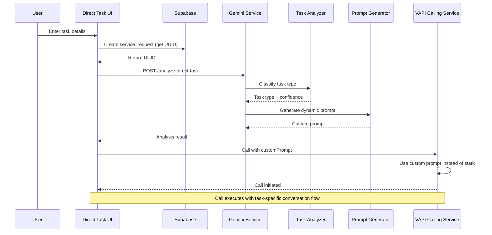

### Task Types Supported

| Task Type           | Description                                            | Example Use Cases                                    |
| ------------------- | ------------------------------------------------------ | ---------------------------------------------------- |
| `negotiate_price`   | Price negotiation, bill reduction                      | "Lower my cable bill", "Negotiate gym membership"    |
| `request_refund`    | Charge disputes, refund requests                       | "Get refund for cancelled flight", "Dispute charge"  |
| `complain_issue`    | Filing complaints, demanding resolution                | "Complaint about service outage", "Demand fix"       |
| `schedule_appointment` | Booking, scheduling                                 | "Schedule dentist appointment", "Book car service"   |
| `cancel_service`    | Service cancellation                                   | "Cancel subscription", "End membership"              |
| `make_inquiry`      | Information gathering, asking questions                | "Ask about hours", "Check policy"                    |
| `general_task`      | Catch-all for tasks that don't fit other categories    | Any other type of task                               |

### Service Layer Files

| File                                                | Purpose                                                        |
| --------------------------------------------------- | -------------------------------------------------------------- |
| `apps/api/src/services/direct-task/types.ts`        | TypeScript definitions for all 7 task types and analysis schema |
| `apps/api/src/services/direct-task/analyzer.ts`     | Gemini-powered task classification (determines task type)       |
| `apps/api/src/services/direct-task/prompt-generator.ts` | Generates dynamic prompts based on task type and context    |
| `apps/api/src/services/vapi/types.ts`               | Updated `CallRequest` with optional `customPrompt` field       |

### API Endpoint

#### POST `/api/v1/gemini/analyze-direct-task`

Analyzes a user's task description and generates a custom prompt for VAPI calls.

**Request Body:**

```typescript
{
  taskDescription: string;      // User's description of what they want done
  businessName: string;         // Company to contact
  phoneNumber: string;          // Phone number to call
  accountInfo?: string;         // Account number, customer ID, etc.
  previousContext?: string;     // Any prior interactions or history
}
```

**Response:**

```typescript
{
  taskType: TaskType;           // One of 7 task types
  confidence: number;           // Classification confidence (0-1)
  customPrompt: string;         // Generated task-specific prompt
  suggestedApproach: string;    // Strategy recommendation
  keyPoints: string[];          // Important points to cover
}
```

**Example:**

```bash
POST /api/v1/gemini/analyze-direct-task
{
  "taskDescription": "I want to negotiate my $200/month internet bill down because I've been a customer for 5 years",
  "businessName": "Comcast",
  "phoneNumber": "+18005551234",
  "accountInfo": "Account #12345"
}

# Response
{
  "taskType": "negotiate_price",
  "confidence": 0.95,
  "customPrompt": "Hello, I'm calling on behalf of a long-term customer (5 years) regarding their internet service bill which is currently $200/month. We'd like to discuss available discounts or promotional rates for loyal customers. The customer has been very satisfied with the service and would like to continue, but needs a more competitive rate to stay within budget. Can we review the account to see what options are available?",
  "suggestedApproach": "Start friendly, mention loyalty, ask about promotions",
  "keyPoints": [
    "5-year customer loyalty",
    "Current rate: $200/month",
    "Open to promotions/discounts",
    "Wants to continue service"
  ]
}
```

### Call Flow Integration

The `customPrompt` field flows through the entire calling chain:

```typescript
// 1. Frontend creates request with custom prompt
const callRequest: CallRequest = {
  phoneNumber: "+18005551234",
  providerName: "Comcast",
  customPrompt: analysisResult.customPrompt,  // NEW: Dynamic prompt
  // ... other fields
};

// 2. ProviderCallingService receives it
async makeCall(request: CallRequest): Promise<CallResult> {
  // Passes customPrompt to DirectVapiClient or KestraClient
}

// 3. DirectVapiClient uses custom prompt
const assistantConfig = {
  firstMessage: request.customPrompt || DEFAULT_PROMPT,  // Use custom if available
  // ... rest of config
};

// 4. VAPI executes call with task-specific opening
```

### Updated Type Definitions

**CallRequest** (in `apps/api/src/services/vapi/types.ts`):

```typescript
export interface CallRequest {
  phoneNumber: string;
  serviceNeeded?: string;
  userCriteria?: string;
  location?: string;
  providerName: string;
  urgency?: string;
  customPrompt?: string;        // NEW: Optional custom prompt for Direct Tasks
}
```

### Example: Complaint Task Flow

Let's trace a complaint task through the system:

**User Input:**
```
Task: "I need to complain about billing errors on my account that haven't been fixed for 2 months"
Business: "Verizon Wireless"
Phone: "+18005551234"
Account: "#987654"
```

**Step 1: Task Analysis**
```typescript
// POST /api/v1/gemini/analyze-direct-task
{
  taskType: "complain_issue",
  confidence: 0.92,
  customPrompt: "I'm calling to file a formal complaint regarding persistent billing errors on account #987654. These issues have been ongoing for 2 months despite multiple attempts to resolve them. The customer needs this addressed immediately and would like to escalate to a supervisor if necessary. Can you help resolve these billing discrepancies?",
  suggestedApproach: "Be firm but professional, document issue timeline, request supervisor escalation if needed",
  keyPoints: [
    "Formal complaint",
    "2 months of unresolved issues",
    "Account #987654",
    "Previous attempts made",
    "Supervisor escalation may be needed"
  ]
}
```

**Step 2: Create Database Record**
```typescript
// Create service_request first to get UUID
const { data } = await supabase
  .from('service_requests')
  .insert({
    content: taskDescription,
    status: 'pending',
    criteria: { taskType: 'complain_issue' }
  })
  .select()
  .single();

const requestId = data.id; // Proper UUID: "550e8400-e29b-41d4-a716-446655440000"
```

**Step 3: Make VAPI Call with Custom Prompt**
```typescript
const callRequest: CallRequest = {
  phoneNumber: "+18005551234",
  providerName: "Verizon Wireless",
  customPrompt: analysisResult.customPrompt,  // Task-specific prompt
  urgency: "high"
};

await providerCallingService.makeCall(callRequest);
```

**Step 4: VAPI Call Execution**
```
AI: "I'm calling to file a formal complaint regarding persistent billing
     errors on account #987654. These issues have been ongoing for 2 months..."

Rep: "I'm sorry to hear that. Let me pull up your account..."

AI: "We've tried to resolve this multiple times. Can I speak with a supervisor?"

Rep: "Let me transfer you to our escalations department..."

[Call continues with complaint-specific conversation]
```

### Database-First Pattern Fix

**Previous Bug**: Used temporary `task-xxx` IDs that broke on database save

```typescript
// OLD - BROKEN
const tempId = `task-${Date.now()}`;  // "task-1234567890"
// Later: Database expects UUID, receives "task-1234567890" → ERROR
```

**New Solution**: Create database record FIRST

```typescript
// NEW - CORRECT
// 1. Create DB record immediately
const { data } = await supabase
  .from('service_requests')
  .insert({ content, status: 'pending' })
  .select()
  .single();

// 2. Use real UUID for all operations
const requestId = data.id;  // "550e8400-e29b-41d4-a716-446655440000"

// 3. All subsequent operations use valid UUID
await analyzeTask(requestId);
await makeCall(requestId);
```

### Benefits of Dynamic Prompts

1. **Task-Specific Conversations**: AI knows exact intent (negotiate vs complain vs inquire)
2. **Better Success Rates**: Tailored approach increases likelihood of achieving user's goal
3. **Context Awareness**: Prompts include account info, history, and specific details
4. **Professional Tone Matching**: Negotiation is friendly, complaints are firm, inquiries are neutral
5. **Clearer Instructions**: AI receives explicit guidance on what to accomplish

### Future Enhancements

- **Multi-step task flows**: Chain multiple calls or actions for complex tasks
- **Learning from outcomes**: Refine prompts based on successful vs failed calls
- **Industry-specific templates**: Specialized prompts for healthcare, utilities, retail, etc.
- **User preference memory**: Remember user's preferred tone, aggression level, etc.

---

## Address Autocomplete Architecture (December 2025)

### Overview

The Address Autocomplete feature solves a critical problem in the VAPI calling system: **the AI was making up fake addresses** when providing client locations to service providers. This happened because users only provided city/state (e.g., "Greenville, SC"), and the AI would generate plausible but incorrect street addresses during calls.

**Problem:**
```
User Input: "Greenville, SC"
VAPI Call: "The client is located at 123 Main Street, Greenville, SC" ❌ MADE UP
Result: Provider goes to wrong address, wastes time, poor user experience
```

**Solution:**
The app now uses Google Places Autocomplete to capture the **full structured address** from the user upfront, eliminating AI hallucination and ensuring providers receive accurate location information.

### Solution Architecture

The architecture introduces three key components:

1. **Frontend Autocomplete Component** - Reusable Google Places Autocomplete with structured data extraction
2. **Dual Location Fields** - Backward-compatible API that accepts both legacy `location` and new `clientAddress`
3. **Conditional VAPI Prompts** - Smart prompt logic that uses real address when available, graceful fallback when not

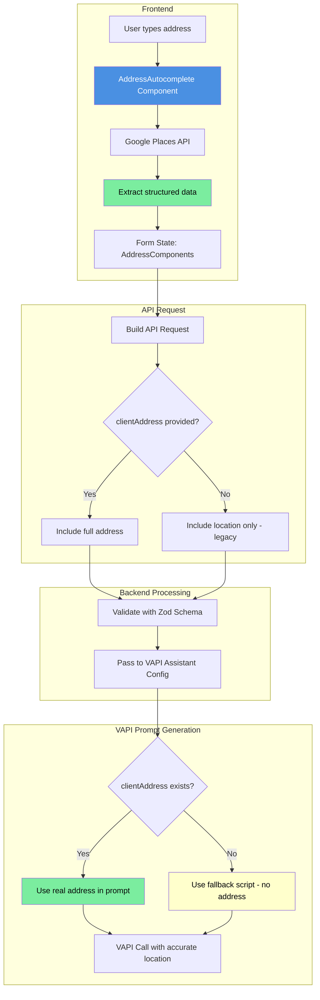

### AddressComponents Interface

The system uses a strongly-typed `AddressComponents` interface to ensure data consistency across the entire application:

```typescript
// Shared interface for structured address data
interface AddressComponents {
  formatted: string;      // "123 Main St, Greenville, SC 29601"
  street: string;         // "123 Main St"
  city: string;           // "Greenville"
  state: string;          // "SC"
  zip: string;            // "29601"
  placeId?: string;       // "ChIJRURMfy-gVogRtM_hIBmcucM" (Google Place ID)
}
```

**Field Breakdown:**

| Field       | Purpose                                               | Example                           | Required |
|-------------|-------------------------------------------------------|-----------------------------------|----------|
| `formatted` | Complete address for display and storage             | "123 Main St, Greenville, SC 29601" | Yes      |
| `street`    | Street address only (used in VAPI prompts)            | "123 Main St"                     | Yes      |
| `city`      | City name                                             | "Greenville"                      | Yes      |
| `state`     | State code (2 letters)                                | "SC"                              | Yes      |
| `zip`       | ZIP/postal code                                       | "29601"                           | Yes      |
| `placeId`   | Google Place ID for reference/validation              | "ChIJRURMfy-gVogRtM_hIBmcucM"     | No       |

### Frontend Component (`packages/ui/src/address-autocomplete.tsx`)

The `AddressAutocomplete` component is a **reusable, framework-agnostic** React component that provides Google Places Autocomplete with smart data extraction.

**Key Features:**

1. **Autocomplete Integration** - Uses Google Places Autocomplete API with `usePlacesAutocomplete` hook
2. **Smart Data Extraction** - Parses Google's address_components into structured fields
3. **Real-time Validation** - Ensures all required fields (street, city, state, zip) are present
4. **Error Handling** - Graceful fallback if Google API unavailable or address incomplete
5. **Customizable UI** - Accepts className for styling, provides clear visual feedback

**Implementation Example:**

```typescript
import { AddressAutocomplete } from "@repo/ui/address-autocomplete";

export default function MyForm() {
  const [address, setAddress] = useState<AddressComponents>({
    formatted: "",
    street: "",
    city: "",
    state: "",
    zip: "",
  });

  return (
    <AddressAutocomplete
      value={address.formatted}
      onChange={setAddress}
      placeholder="Enter your address"
      className="w-full"
    />
  );
}
```

**Data Extraction Logic:**

The component uses Google's `address_components` array to extract structured data:

```typescript
// Google returns: address_components = [
//   { types: ["street_number"], long_name: "123" },
//   { types: ["route"], long_name: "Main St" },
//   { types: ["locality"], long_name: "Greenville" },
//   { types: ["administrative_area_level_1"], short_name: "SC" },
//   { types: ["postal_code"], long_name: "29601" }
// ]

const extractAddressComponents = (details): AddressComponents => {
  const components = details.address_components;

  // Extract each field using Google's type system
  const streetNumber = findComponent(components, "street_number");
  const route = findComponent(components, "route");
  const city = findComponent(components, "locality");
  const state = findComponent(components, "administrative_area_level_1", "short_name");
  const zip = findComponent(components, "postal_code");

  return {
    formatted: details.formatted_address,
    street: `${streetNumber} ${route}`.trim(),
    city,
    state,
    zip,
    placeId: details.place_id,
  };
};
```

### Backend Integration

#### API Schema (`apps/api/src/routes/providers.ts`)

The Zod validation schema supports **both** legacy and new address formats for backward compatibility:

```typescript
// Search providers request schema
const searchProvidersRequestSchema = z.object({
  content: z.string().min(1, "Service description is required"),
  location: z.string().min(1, "Location is required"),  // LEGACY: "Greenville, SC"
  urgency: z.string().optional(),
  criteria: z.string().optional(),
  clientAddress: z.string().optional(),  // NEW: Full address from autocomplete
});

// Contact provider request schema
const contactProviderRequestSchema = z.object({
  requestId: z.string().uuid(),
  providerId: z.string().uuid(),
  serviceNeeded: z.string(),
  userCriteria: z.string().optional(),
  location: z.string(),           // LEGACY
  clientAddress: z.string().optional(),  // NEW
  urgency: z.string().optional(),
});
```

**Backward Compatibility Strategy:**

| Request Scenario | `location` Field | `clientAddress` Field | VAPI Behavior |
|------------------|------------------|----------------------|---------------|
| **New Form (with autocomplete)** | "Greenville, SC" | "123 Main St, Greenville, SC 29601" | Uses clientAddress ✅ |
| **Legacy Form (no autocomplete)** | "Greenville, SC" | undefined | Uses fallback script ⚠️ |
| **API-only requests** | "Greenville, SC" | undefined | Uses fallback script ⚠️ |

### VAPI Prompt Conditional Logic

#### Research Assistant Config (`apps/api/src/services/vapi/assistant-config.ts`)

The VAPI assistant prompt adapts based on whether `clientAddress` is available:

```typescript
export function createAssistantConfig(
  request: CallRequest,
  customPrompt?: GeneratedPrompt
) {
  const { clientAddress, location } = request;

  // CONDITIONAL: Use real address or fallback script
  const addressScript = clientAddress
    ? `The client's address is ${clientAddress}.`
    : `If they ask for the client's address, let them know we'll provide that once they confirm availability and pricing.`;

  const firstMessage = customPrompt?.prompt || `
Hello! I'm calling on behalf of a client who needs ${request.serviceNeeded || "service"}
in ${location}. ${addressScript}

${request.userCriteria ? `The client specifically needs: ${request.userCriteria}.` : ""}

I'd like to confirm a few quick things:
1. Do you have availability ${request.urgency || "soon"}?
2. What are your rates for this type of work?
${request.userCriteria ? "3. Can you meet the specific requirements mentioned?" : ""}

This will only take a minute or two. Does that work?
  `.trim();

  return {
    name: `Concierge-${Date.now()}`,
    firstMessage,
    // ... rest of config
  };
}
```

**Example Prompts:**

**With clientAddress (New Flow):**
```
Hello! I'm calling on behalf of a client who needs plumbing service in Greenville, SC.
The client's address is 123 Main St, Greenville, SC 29601. ✅

I'd like to confirm a few quick things:
1. Do you have availability within 2 days?
2. What are your rates for this type of work?
```

**Without clientAddress (Legacy/Fallback):**
```
Hello! I'm calling on behalf of a client who needs plumbing service in Greenville, SC.
If they ask for the client's address, let them know we'll provide that once they confirm
availability and pricing. ⚠️

I'd like to confirm a few quick things:
1. Do you have availability within 2 days?
2. What are your rates for this type of work?
```

#### Booking Assistant Config (`apps/api/src/services/vapi/booking-assistant-config.ts`)

The booking flow also uses conditional address logic:

```typescript
export function createBookingAssistantConfig(request: BookingCallRequest) {
  const { clientAddress, location } = request;

  const addressScript = clientAddress
    ? `The service address is ${clientAddress}.`
    : `For the service address, please let them know we'll provide that when we call back to confirm.`;

  const firstMessage = `
Hello! I'm calling back on behalf of [Client Name] to schedule an appointment for
${request.serviceNeeded || "service"} in ${location}.

${addressScript}

We discussed:
- Service needed: ${request.serviceNeeded}
- Estimated rate: ${request.estimatedRate || "To be confirmed"}
- ${request.criteria ? `Requirements: ${request.criteria}` : ""}

What times work best for your schedule?
  `.trim();

  // ... rest of config
}
```

### Environment Configuration

The frontend requires a Google Places API key to enable autocomplete:

```bash
# apps/web/.env.local
NEXT_PUBLIC_GOOGLE_PLACES_API_KEY=your-google-api-key-here
```

**Key Requirements:**

1. **API Key Restrictions** - Recommended to restrict by HTTP referrer (your domain)
2. **Enabled APIs** - Ensure "Places API" is enabled in Google Cloud Console
3. **Billing Account** - Required for Places API (though autocomplete is usually free tier)

**Without API Key:**

If `NEXT_PUBLIC_GOOGLE_PLACES_API_KEY` is not set:
- Autocomplete component shows standard text input (graceful degradation)
- User can still type city/state manually
- Form falls back to legacy `location`-only mode
- VAPI uses fallback script (no address provided)

### Data Flow Example

Let's trace a complete request with address autocomplete:

**Step 1: User Input**
```typescript
// User selects from Google autocomplete dropdown
Selected: "123 Main St, Greenville, SC 29601"

// AddressAutocomplete extracts structured data
{
  formatted: "123 Main St, Greenville, SC 29601",
  street: "123 Main St",
  city: "Greenville",
  state: "SC",
  zip: "29601",
  placeId: "ChIJRURMfy-gVogRtM_hIBmcucM"
}
```

**Step 2: Form Submission**
```typescript
// Frontend sends both fields for backward compatibility
POST /api/v1/gemini/search-providers
{
  content: "Need emergency plumbing",
  location: "Greenville, SC",           // LEGACY - for DB queries
  clientAddress: "123 Main St, Greenville, SC 29601",  // NEW - for VAPI
  urgency: "within_24_hours",
  criteria: "Licensed, emergency service"
}
```

**Step 3: Backend Validation**
```typescript
// Zod schema validates both fields
const validated = searchProvidersRequestSchema.parse(requestBody);
// ✅ Passes - both location and clientAddress present
```

**Step 4: VAPI Call Creation**
```typescript
// CallRequest includes both fields
const callRequest: CallRequest = {
  phoneNumber: "+18645551234",
  providerName: "ABC Plumbing",
  serviceNeeded: "emergency plumbing",
  location: "Greenville, SC",
  clientAddress: "123 Main St, Greenville, SC 29601",  // ✅ Available
  urgency: "within_24_hours",
};

// Assistant config uses clientAddress
const config = createAssistantConfig(callRequest);
// Prompt includes: "The client's address is 123 Main St, Greenville, SC 29601."
```

**Step 5: VAPI Call Execution**
```
AI: "Hello! I'm calling on behalf of a client who needs emergency plumbing in
     Greenville, SC. The client's address is 123 Main St, Greenville, SC 29601."

Provider: "Great, what floor is the unit on?"

AI: "Let me check with the client and call you back. First, can you confirm your
     rates for emergency plumbing?"

[Call continues with accurate address context]
```

### Files Modified

| File | Purpose | Changes |
|------|---------|---------|
| `packages/ui/src/address-autocomplete.tsx` | **NEW** Reusable autocomplete component | Complete implementation with Google Places integration |
| `apps/web/app/new/page.tsx` | Research & Book form | Added AddressAutocomplete, clientAddress state, API integration |
| `apps/api/src/routes/providers.ts` | API endpoints | Added `clientAddress?: string` to Zod schemas |
| `apps/api/src/services/vapi/assistant-config.ts` | VAPI research prompts | Conditional address logic based on clientAddress |
| `apps/api/src/services/vapi/booking-assistant-config.ts` | VAPI booking prompts | Conditional address logic for scheduling calls |
| `apps/api/src/services/vapi/types.ts` | TypeScript types | Added `clientAddress?: string` to CallRequest interface |

### Benefits

1. **Eliminates AI Hallucination** - No more made-up addresses
2. **Better Provider Experience** - Providers get accurate location information upfront
3. **Improved Scheduling** - Providers can assess travel time/distance before committing
4. **User Confidence** - Users see their exact address in the system
5. **Backward Compatible** - Legacy forms without autocomplete still work
6. **Graceful Degradation** - Falls back to city/state if Google API unavailable

### Future Enhancements

- **Address Validation** - Verify address exists and is serviceable
- **Distance Calculation** - Show distance from provider to client address in research results
- **Map Visualization** - Display client location and provider locations on interactive map
- **Service Area Filtering** - Filter providers based on whether they serve the client's area
- **Multi-location Support** - Handle requests for multiple service addresses

---

## 1. High-Level System Architecture

### Current State (Day 3+)

The system now features a **VAPI Fallback Architecture** that automatically detects Kestra availability and routes phone calls appropriately. This enables production deployment on Railway (without Kestra) using direct VAPI API calls.

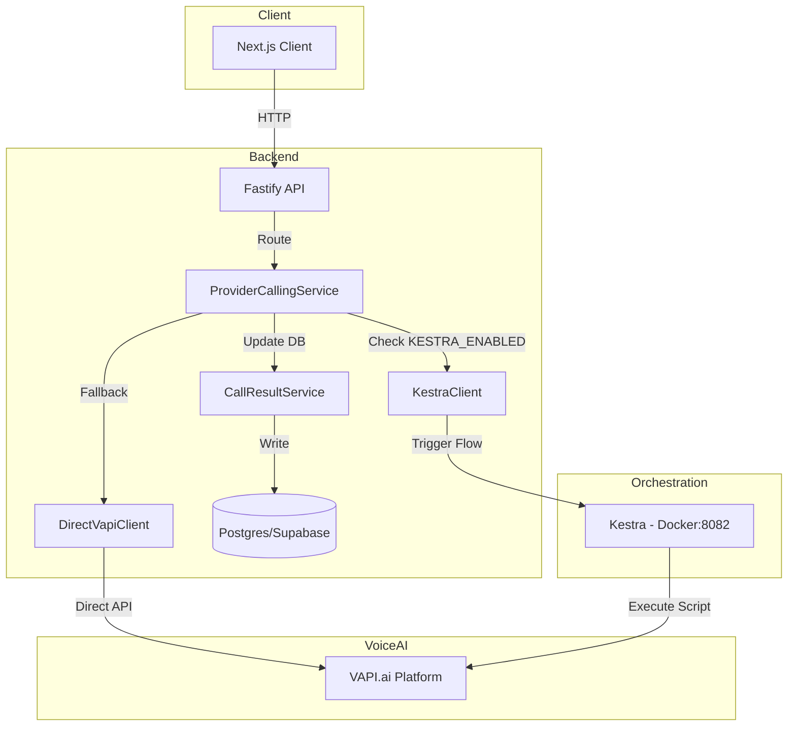

### VAPI Fallback Decision Flow

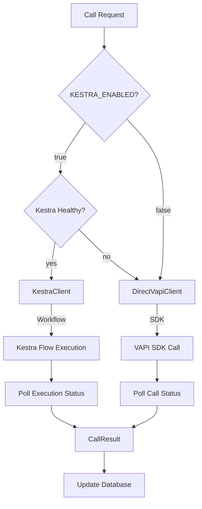

### Target State (End of Day 5) (Target State)

This diagram illustrates the complete system architecture including the new Kestra orchestration and Cline automation components.

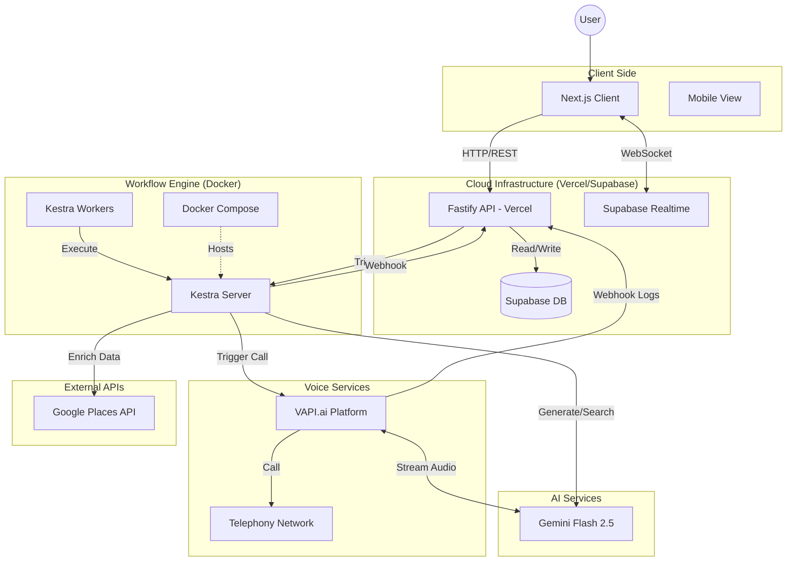

## 2. Provider Calling Service Architecture

### DirectVapiClient Hybrid Webhook Architecture (December 2025)

The `DirectVapiClient` now supports a **hybrid approach** for optimal performance:

1. **Primary Path (Webhook)**: When `VAPI_WEBHOOK_URL` is configured, uses webhooks for fast results
2. **Fallback Path (Polling)**: When webhook times out or isn't configured, polls VAPI directly

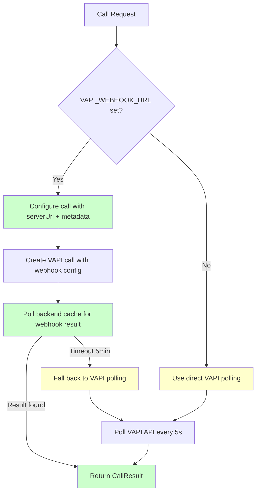

**Benefits:**
- **31x fewer VAPI API calls** when using webhooks
- **<500ms latency** vs 2.5s average with polling
- **Automatic database persistence** via existing webhook infrastructure
- **Works everywhere**: Polling fallback for local dev without ngrok

**Configuration:**
```bash
# When set: Uses webhook + cache polling (fast path)
VAPI_WEBHOOK_URL=https://your-domain.com/api/v1/vapi/webhook

# When not set: Uses direct VAPI polling (works everywhere)
# VAPI_WEBHOOK_URL=

# Backend URL for internal cache polling
BACKEND_URL=http://localhost:8000
```

### Service Layer (`apps/api/src/services/vapi/`)

| File                          | Purpose                                                               |
| ----------------------------- | --------------------------------------------------------------------- |
| `types.ts`                    | Shared type definitions (CallRequest, CallResult, StructuredCallData) |
| `assistant-config.ts`         | VAPI assistant configuration (voice, prompts, analysis schema)        |
| `webhook-config.ts`           | VAPI webhook configuration (server URL, metadata, shared settings)    |
| `direct-vapi.client.ts`       | Direct VAPI SDK integration with hybrid webhook/polling               |
| `kestra.client.ts`            | Kestra workflow trigger and status polling                            |
| `call-result.service.ts`      | Database updates for providers and interaction_logs                   |
| `provider-calling.service.ts` | Main orchestrator (routes between Kestra/DirectVAPI)                  |
| `webhook-cache.service.ts`    | In-memory cache for webhook results (30min TTL)                       |
| `index.ts`                    | Service exports                                                       |

### VAPI Assistant Configuration (Single Source of Truth)

**Files**:
- `/apps/api/src/services/vapi/assistant-config.ts` - Base assistant behavior (voice, prompts, analysis schema)
- `/apps/api/src/services/vapi/webhook-config.ts` - Webhook-enabled configuration (server URL, metadata)

These files are the **single source of truth** for VAPI assistant behavior. Both Direct VAPI and Kestra paths use these configurations to ensure identical call behavior, implementing the DRY (Don't Repeat Yourself) principle.

#### Architecture Benefits:

- **~467 lines of duplicated code eliminated** - Configuration defined once, used everywhere
- **Consistent behavior** - Direct VAPI and Kestra paths produce identical calls
- **TypeScript as source of truth** - Type safety and IDE support for configuration
- **Kestra scripts import from compiled dist** - JavaScript scripts load from `apps/api/dist/services/vapi/assistant-config.js`

#### Build Requirement:

Before running Kestra scripts, the API must be built to compile TypeScript:

```bash
pnpm build  # or pnpm --filter api build
```

#### Key Features:

**1. Disqualification Detection & Handling**

The assistant actively detects during calls when a provider cannot meet requirements:

- **Unavailability** - Provider not available within required timeframe
- **Criteria not met** - Cannot satisfy specific client requirements
- **Unreasonable rates** - Pricing significantly higher than market
- **Wrong service type** - Doesn't perform the type of work needed

When disqualified, uses polite exit script:

```
"Thank you so much for taking the time to chat. Unfortunately, it sounds like
this particular request might not be the best fit right now, but I really
appreciate your help. Have a wonderful day!"
```

**No mention of scheduling or callbacks** - clear termination

**2. Conditional Closing Logic**

The assistant adapts its closing based on provider qualification:

| Condition            | Closing Script                                                                                                                                                         | Callback Mentioned? |
| -------------------- | ---------------------------------------------------------------------------------------------------------------------------------------------------------------------- | ------------------- |
| **All criteria met** | "Perfect, thank you so much for all that information! Once I confirm with my client, if they decide to proceed, I'll call you back to schedule. Does that sound good?" | YES                 |
| **Disqualified**     | Polite exit script (see above)                                                                                                                                         | NO                  |

**3. Structured Data Schema**

The assistant captures comprehensive data from each call:

```typescript
{
  // Existing fields
  availability: "available" | "unavailable" | "callback_requested" | "unclear",
  estimated_rate: string,
  single_person_found: boolean,
  technician_name?: string,
  all_criteria_met: boolean,
  criteria_details: object,
  call_outcome: "positive" | "negative" | "neutral" | "no_answer" | "voicemail",
  recommended: boolean,
  notes: string,

  // NEW FIELDS for disqualification tracking
  earliest_availability: string,        // "Tomorrow at 2pm", "Friday morning", etc.
  disqualified: boolean,                // Was provider disqualified?
  disqualification_reason?: string      // Why they were disqualified
}
```

**4. Single Person Requirement Enforcement**

The assistant ensures all criteria apply to **one single person**, not multiple technicians:

- First question: "Do you have a technician who [first requirement]?"
- Follow-ups: "And is this **same person** also [next requirement]?"
- Continuous reference: "The technician you mentioned - are they also [requirement]?"

This prevents providers from offering different people for different requirements.

#### Configuration Usage:

**TypeScript/API (Direct VAPI):**

```typescript
import { createAssistantConfig } from './assistant-config.js';

const config = createAssistantConfig({
  phoneNumber: "+1234567890",
  serviceNeeded: "plumbing",
  userCriteria: "Licensed, 10+ years experience",
  location: "Greenville, SC",
  providerName: "ABC Plumbing",
  urgency: "within_2_days"
});

// Use with VAPI SDK
await vapi.calls.create({ assistant: config, ... });
```

**JavaScript/Kestra (Imported from compiled dist):**

```javascript
// Kestra script imports from compiled TypeScript
const { createAssistantConfig } = await import(
  '../../apps/api/dist/services/vapi/assistant-config.js'
);

const config = createAssistantConfig(callRequest);
await vapi.calls.create({ assistant: config, ... });
```

### Call Flow with Disqualification Logic

This diagram shows how the VAPI assistant handles provider calls with intelligent disqualification detection:

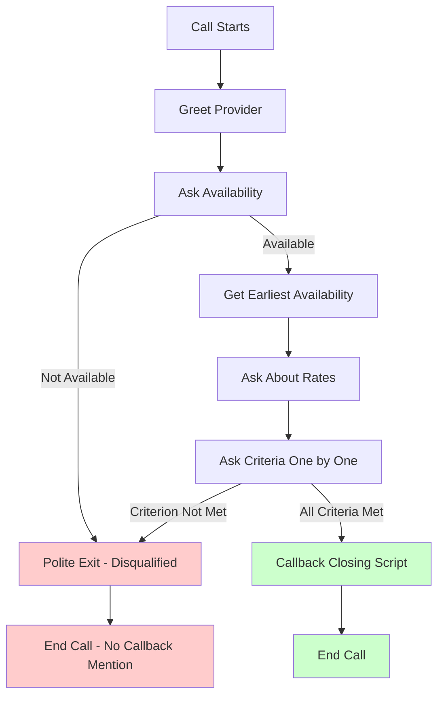

**Key Decision Points:**

1. **Availability Check** - First gate: if unavailable, immediate polite exit
2. **Earliest Availability** - If available, capture specific date/time
3. **Rate Check** - Gather pricing information
4. **Criteria Validation** - Each criterion checked sequentially for the SAME person
5. **Conditional Closing** - Different scripts for qualified vs disqualified providers

**Data Captured:**

- ✅ Qualified: `disqualified: false`, uses callback closing, captures all criteria details
- ❌ Disqualified: `disqualified: true`, `disqualification_reason: string`, polite exit only

### CallRequest Type Definition

```typescript
export interface CallRequest {
  phoneNumber: string;
  serviceNeeded?: string;
  userCriteria?: string;
  location?: string;
  providerName: string;
  urgency?: string;
  customPrompt?: string;        // NEW: Optional custom prompt for Direct Tasks
}
```

**Fields:**

| Field           | Type     | Required | Description                                                    |
| --------------- | -------- | -------- | -------------------------------------------------------------- |
| `phoneNumber`   | string   | Yes      | Provider's phone number to call                                |
| `serviceNeeded` | string   | No       | Type of service (e.g., "plumbing", "electrical")               |
| `userCriteria`  | string   | No       | Requirements (e.g., "Licensed, 10+ years experience")          |
| `location`      | string   | No       | Service location                                               |
| `providerName`  | string   | Yes      | Name of the provider being called                              |
| `urgency`       | string   | No       | Timeline (e.g., "within_2_days", "emergency")                  |
| `customPrompt`  | string   | No       | **NEW**: Custom opening prompt for Direct Tasks (overrides default) |

### API Endpoints

| Endpoint                        | Method | Purpose                                     |
| ------------------------------- | ------ | ------------------------------------------- |
| `/api/v1/providers/call`        | POST   | Initiate phone call to provider             |
| `/api/v1/providers/call/status` | GET    | Check system status (active method, health) |

### Admin Test Mode Architecture (December 2025)

The Admin Test Mode allows developers to safely test VAPI integration with real phone calls without calling actual providers. The architecture supports both single-phone testing (legacy) and multi-phone concurrent testing (recommended).

#### Array-Based Test Phone Numbers

**Problem Solved:**

Previously, `NEXT_PUBLIC_ADMIN_TEST_NUMBER` only supported a single test phone number. When testing concurrent calling (5 providers simultaneously), all calls went to the same phone - not a realistic test scenario.

**Solution:** `NEXT_PUBLIC_ADMIN_TEST_PHONES` accepts a comma-separated array of test phone numbers:

```bash
# In apps/web/.env.local
NEXT_PUBLIC_ADMIN_TEST_PHONES=+13105551234,+13105555678,+13105559012
```

**Behavior:**

| Config | Research Returns | Providers Called | Phone Assignment |
|--------|------------------|------------------|------------------|
| 3 test phones | 10 providers | 3 | Provider 1 → Phone 1, Provider 2 → Phone 2, Provider 3 → Phone 3 |
| 1 test phone | 10 providers | 1 | Provider 1 → Phone 1 (backward compat) |
| No test phones | 10 providers | 10 | Each provider uses their real phone |

#### Implementation Flow

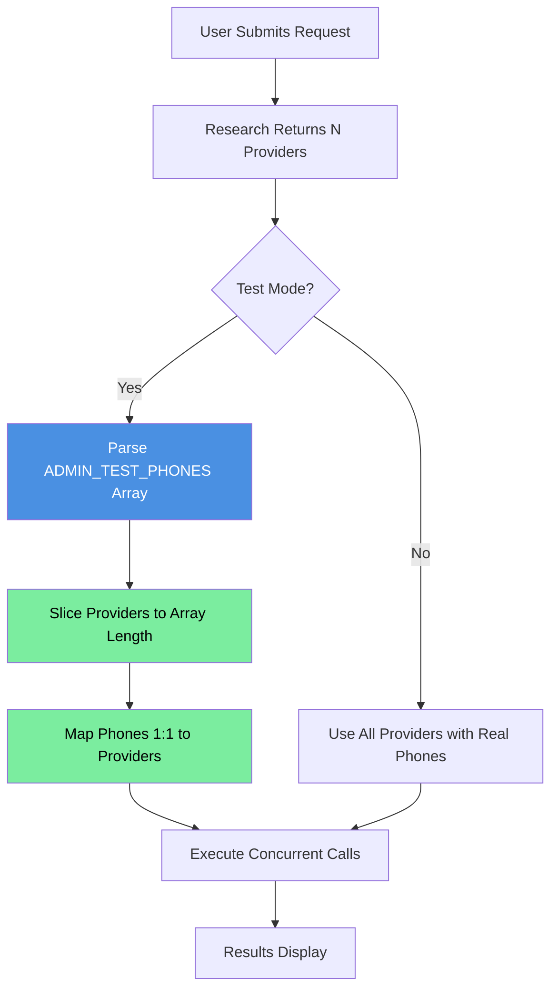

#### Key Implementation Files

| File | Purpose |
|------|---------|
| `apps/web/app/new/page.tsx` | Parses `ADMIN_TEST_PHONES`, limits providers, maps phones 1:1 |
| `apps/web/app/direct/page.tsx` | Uses first test phone from array for single direct tasks |
| `apps/web/.env.local.example` | Documents both new and legacy env vars |

#### Code Implementation

```typescript
// apps/web/app/new/page.tsx

// Parse array of test phones (comma-separated)
const ADMIN_TEST_PHONES_RAW = process.env.NEXT_PUBLIC_ADMIN_TEST_PHONES;
const ADMIN_TEST_PHONES = ADMIN_TEST_PHONES_RAW
  ? ADMIN_TEST_PHONES_RAW.split(",").map((p) => p.trim()).filter(Boolean)
  : [];

// Backward compatibility with legacy single number
const ADMIN_TEST_NUMBER_LEGACY = process.env.NEXT_PUBLIC_ADMIN_TEST_NUMBER;
if (ADMIN_TEST_NUMBER_LEGACY && ADMIN_TEST_PHONES.length === 0) {
  ADMIN_TEST_PHONES.push(ADMIN_TEST_NUMBER_LEGACY);
}

const isAdminTestMode = ADMIN_TEST_PHONES.length > 0;

// In the call loop:
// 1. Limit providers to test phone count
const providersToCall = isAdminTestMode
  ? providers.slice(0, ADMIN_TEST_PHONES.length)
  : providers;

// 2. Map test phones 1:1 to providers
const phoneToCall = isAdminTestMode
  ? normalizePhoneNumber(ADMIN_TEST_PHONES[providerIndex]!)
  : normalizePhoneNumber(provider.phone);
```

#### Console Logging in Test Mode

When running in test mode, the console shows clear mapping information:

```
[Concierge] Starting calls to 3 providers (LIVE_CALL_ENABLED=true, ADMIN_TEST_MODE=true)
[Concierge] ADMIN TEST MODE: Will call 3 provider(s) using test phones: +13105551234, +13105555678, +13105559012
[Concierge] Phone mapping: ABC Plumbing → +13105551234, XYZ Electric → +13105555678, 123 HVAC → +13105559012
```

#### Backward Compatibility

The implementation maintains full backward compatibility:

1. **New array variable takes precedence** - If `ADMIN_TEST_PHONES` is set, it's used
2. **Legacy single variable still works** - If only `ADMIN_TEST_NUMBER` is set, it's treated as an array with one element
3. **No breaking changes** - Existing `.env.local` files with single test number continue to work

### Environment Configuration

```bash
# Kestra Configuration
KESTRA_ENABLED=false              # Set true for local/staging with Kestra
KESTRA_URL=http://localhost:8082
KESTRA_NAMESPACE=ai_concierge
KESTRA_HEALTH_CHECK_TIMEOUT=3000

# VAPI Configuration (Required)
VAPI_API_KEY=your-key
VAPI_PHONE_NUMBER_ID=your-phone-id

# VAPI Webhook Configuration (Optional - enables hybrid mode)
# When set: DirectVapiClient uses webhooks + cache polling (fast, auto-persistence)
# When not set: DirectVapiClient uses direct VAPI polling (works everywhere)
VAPI_WEBHOOK_URL=https://your-domain.com/api/v1/vapi/webhook

# Backend URL for webhook result polling (used by DirectVapiClient)
# Default: http://localhost:8000
BACKEND_URL=http://localhost:8000
```

### DRY Architecture: Shared Configuration Between API and Kestra

The VAPI assistant configuration demonstrates a sophisticated DRY (Don't Repeat Yourself) architecture that eliminates code duplication between TypeScript API services and JavaScript Kestra scripts.

#### Problem Solved:

Previously, the same VAPI assistant configuration existed in multiple places:

- `apps/api/src/services/vapi/assistant-config.ts` (TypeScript)
- `kestra/scripts/call-provider.js` (JavaScript - duplicated logic)
- `kestra/scripts/call-provider-webhook.js` (JavaScript - duplicated logic)

This resulted in:

- **~467 lines of duplicated code**
- **Maintenance burden** - changes had to be made in 3 places
- **Inconsistency risk** - configurations could drift out of sync
- **No type safety** in JavaScript duplicates

#### Solution: TypeScript as Single Source of Truth

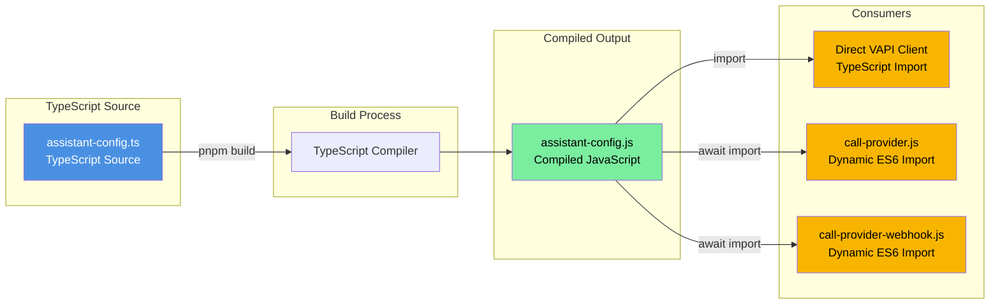

#### Implementation Details:

**1. TypeScript Source (Single Source of Truth):**

```typescript
// apps/api/src/services/vapi/assistant-config.ts
export function createAssistantConfig(request: CallRequest) {
  return {
    name: `Concierge-${Date.now()}`,
    voice: { provider: "11labs", voiceId: "..." },
    model: { provider: "google", model: "gemini-2.5-flash" },
    analysisPlan: {
      structuredDataPlan: {
        schema: {
          properties: {
            disqualified: { type: "boolean" },
            disqualification_reason: { type: "string" },
            earliest_availability: { type: "string" },
            // ... all other fields
          },
        },
      },
    },
  };
}
```

**2. TypeScript Build Output:**

```bash
# Build command compiles TypeScript to JavaScript
pnpm build  # or pnpm --filter api build

# Output location:
apps/api/dist/services/vapi/assistant-config.js  # ES6 module
```

**3. TypeScript Consumer (Direct VAPI):**

```typescript
// apps/api/src/services/vapi/direct-vapi.client.ts
import { createAssistantConfig } from "./assistant-config.js";

const config = createAssistantConfig(callRequest);
await this.vapi.calls.create({ assistant: config });
```

**4. JavaScript Consumer (Kestra Scripts):**

```javascript
// kestra/scripts/call-provider.js
let createAssistantConfig;

async function loadAssistantConfig() {
  try {
    // Dynamic import from compiled TypeScript output
    const configModule = await import(
      "../../apps/api/dist/services/vapi/assistant-config.js"
    );
    createAssistantConfig = configModule.createAssistantConfig;
    console.log("[Config] Loaded shared configuration from TypeScript source");
  } catch (error) {
    console.error("[Config] Make sure the API has been built: pnpm build");
    process.exit(1);
  }
}

// Usage
await loadAssistantConfig();
const config = createAssistantConfig(callRequest);
await vapi.calls.create({ assistant: config });
```

#### Webhook Configuration (webhook-config.ts)

The `webhook-config.ts` module extends the DRY pattern for webhook-enabled calls:

**Purpose:**
- Wraps `assistant-config.ts` with webhook server configuration
- Adds metadata that travels with VAPI webhook callbacks
- Fixes VAPI SDK v0.11.0 deprecation (`serverUrl` → `assistant.server.url`)

**Key Exports:**

```typescript
// apps/api/src/services/vapi/webhook-config.ts

// Constants for webhook server configuration
export const WEBHOOK_SERVER_CONFIG = {
  timeoutSeconds: 20,
  serverMessages: ["status-update", "end-of-call-report"] as const,
};

// Create metadata for webhook callbacks
export function createWebhookMetadata(request: CallRequest) {
  return {
    serviceRequestId: request.serviceRequestId || "",
    providerId: request.providerId || "",
    providerName: request.providerName,
    // ... other fields
  };
}

// Create webhook-enabled assistant config
export function createWebhookAssistantConfig(
  request: CallRequest,
  webhookUrl: string,
  customPrompt?: GeneratedPrompt
) {
  const baseConfig = createAssistantConfig(request, customPrompt);
  return {
    ...baseConfig,
    server: {
      url: webhookUrl,  // Uses assistant.server.url (not callParams.serverUrl)
      timeoutSeconds: WEBHOOK_SERVER_CONFIG.timeoutSeconds,
    },
    serverMessages: WEBHOOK_SERVER_CONFIG.serverMessages,
  };
}
```

**Consumers:**

```typescript
// DirectVapiClient (TypeScript)
import { createWebhookAssistantConfig, createWebhookMetadata } from "./webhook-config.js";

if (this.webhookUrl) {
  callParams.assistant = createWebhookAssistantConfig(request, this.webhookUrl);
  callParams.metadata = createWebhookMetadata(request);
}
```

```javascript
// Kestra script (JavaScript) - imports from compiled dist/
const { createWebhookAssistantConfig } = await import(
  '../../apps/api/dist/services/vapi/webhook-config.js'
);

const assistantConfig = createWebhookAssistantConfig(request, webhookUrl);
```

**SDK Deprecation Fix:**

VAPI SDK v0.11.0 deprecated `callParams.serverUrl` in favor of `assistant.server.url`:

```typescript
// BEFORE (broken - VAPI rejects with "property serverUrl should not exist")
callParams.serverUrl = webhookUrl;  // ❌

// AFTER (correct - uses webhook-config.ts)
callParams.assistant = createWebhookAssistantConfig(request, webhookUrl);  // ✅
// This sets assistant.server.url internally
```

#### Key Technical Points:

**ES6 Dynamic Import from CommonJS:**

- Kestra scripts use CommonJS (`require`)
- TypeScript compiles to ES6 modules (`export`)
- `await import()` allows CommonJS to load ES6 modules dynamically

**Build Dependency:**

- Kestra scripts **require** the API to be built first
- Error message directs developers to run `pnpm build`
- CI/CD must ensure build happens before Kestra deployments

**Type Safety Benefits:**

- Configuration defined with TypeScript types
- IDE autocomplete and validation in TypeScript code
- Runtime validation ensures JavaScript consumers get correct structure

#### Architecture Benefits:

| Aspect        | Before (Duplicated)                | After (DRY)                    |
| ------------- | ---------------------------------- | ------------------------------ |
| Lines of Code | ~467 lines × 3 files = 1,401 lines | 267 lines × 1 file = 267 lines |
| Maintenance   | Update 3 files                     | Update 1 file                  |
| Consistency   | Manual sync required               | Guaranteed identical           |
| Type Safety   | Only in TypeScript                 | Source has types               |
| Risk of Drift | High                               | Zero                           |

---

## 3. Kestra Workflow Logic (The "Brain")

### Current State

Individual flows exist and are now callable via fallback services when Kestra is unavailable.

- `research_agent.yaml`: Functional (Gemini Search) - **Now with Direct Gemini fallback via ResearchService**.
- `contact_agent.yaml`: Functional (VAPI Script) - **Now with Direct VAPI fallback via ProviderCallingService**.
- `contact_providers_concurrent.yaml`: Functional (Batch concurrent calls).

### Research Agent Fallback Flow

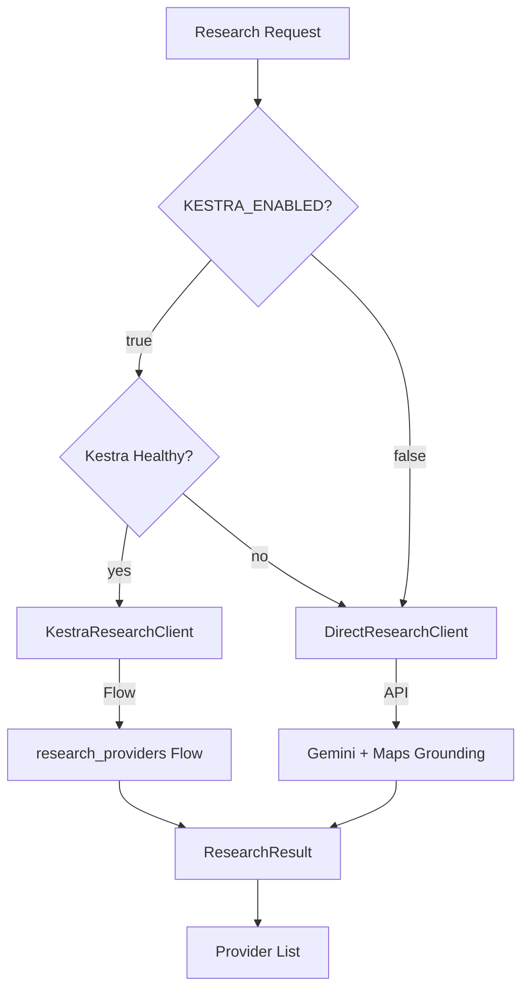

### Target State

The core "Concierge" agentic workflow. **Note:** Users select from top 3 recommended providers (not auto-booking).

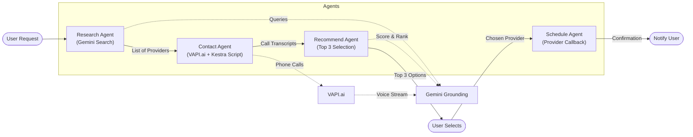

### Kestra Workflow Status

| Workflow | File | Status |
|----------|------|--------|
| `research_providers` | `research_agent.yaml` | Done |
| `contact_providers` | `contact_agent.yaml` | Done |
| `contact_providers_concurrent` | `contact_providers_concurrent.yaml` | Done |
| `recommend_providers` | - | **Needed** |
| `notify_user` | - | **Needed** (SMS via Twilio) |
| `schedule_service` | - | **Needed** (VAPI callback) |

### Backend-Owned Recommendation Generation (December 2025)

The system now features **automatic backend-triggered recommendation generation** after all provider calls complete. This eliminates race conditions and ensures reliable recommendation delivery.

#### Architecture Flow

```
POST /batch-call-async (202 Accepted)
           ↓
  setImmediate() background worker
           ↓
  Kestra batch calls (or Direct VAPI fallback)
           ↓
  resultsInDatabase: true flag received
           ↓
  Poll DB every 2s for all providers to complete (max 30s)
           ↓
  Transform provider data → CallResult format
           ↓
  Trigger Kestra recommend_providers OR Direct Gemini
           ↓
  Update status: ANALYZING → RECOMMENDED
           ↓
  Supabase Realtime broadcasts to frontend
```

#### Implementation Details

**Location**: `apps/api/src/routes/providers.ts` (lines 708-926)

**Trigger Conditions**:
- Activated when `batchResult.resultsInDatabase === true`
- Runs in background via `setImmediate()` - non-blocking

**Key Steps**:

1. **Status Update to ANALYZING** - Immediately updates service request status
2. **Poll for Completion** - Polls database every 2 seconds (max 15 attempts = 30 seconds)
3. **Transform Provider Data** - Converts DB provider records to CallResult format
4. **Generate Recommendations** - Kestra workflow (primary) or Direct Gemini (fallback)
5. **Status Update to RECOMMENDED** - Only if recommendations generated successfully

**Benefits**:
- **Automatic**: No frontend logic to determine when to trigger recommendations
- **Reliable**: Backend owns the entire flow, eliminating race conditions
- **Real-time**: UI updates immediately via Supabase Realtime subscription
- **Resilient**: Kestra-first with Gemini fallback for high availability

## 3. Data Flow & Real-Time Updates

How the user gets feedback without reloading.

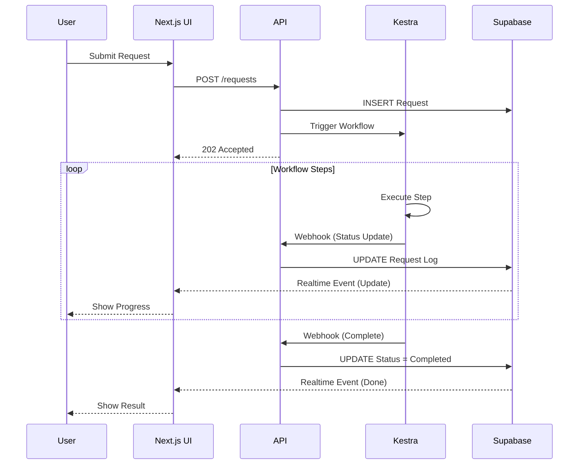

#### Supabase Realtime Technical Details

The frontend receives real-time updates using **Supabase Realtime**, which leverages PostgreSQL's LISTEN/NOTIFY mechanism over WebSocket connections.

**How It Works**:
```
Database Change → PostgreSQL Trigger → pg_notify() → Supabase Realtime Server → WebSocket → Frontend
```

**Subscribed Tables** (`apps/web/app/request/[id]/page.tsx`):

| Table | Event | Filter | Purpose |
|-------|-------|--------|---------|
| `service_requests` | `*` (all) | `id=eq.${id}` | Status changes (ANALYZING → RECOMMENDED) |
| `providers` | `UPDATE` | `request_id=eq.${id}` | Call results, status updates |

**Code Example**:
```typescript
const channel = supabase
  .channel(`request-${id}`)
  .on("postgres_changes", {
    event: "*",
    schema: "public",
    table: "service_requests",
    filter: `id=eq.${id}`
  }, (payload) => {
    // Automatically triggered when request status changes
    setRealtimeRequest(payload.new);
  })
  .on("postgres_changes", {
    event: "UPDATE",
    schema: "public",
    table: "providers",
    filter: `request_id=eq.${id}`
  }, (payload) => {
    // Triggers when call_result, call_status updated
    updateProviderInState(payload.new);
  })
  .subscribe();
```

**Performance Characteristics**:
- **Latency**: ~200ms end-to-end from database update to UI
- **Efficiency**: Only subscribed clients receive filtered updates
- **Scalability**: WebSocket connections managed by Supabase infrastructure
- **Battery-friendly**: No client-side polling required

## 4. Infrastructure & DevOps Pipeline

The CI/CD process for the team.

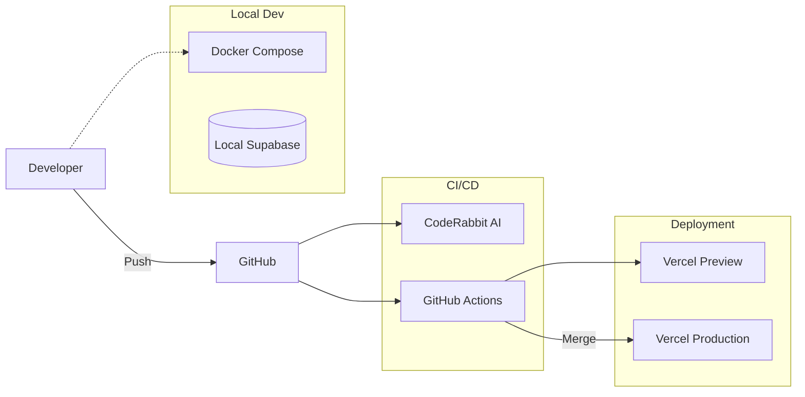

## 5. Domain Model (ER Diagram)

The database schema supporting the application.

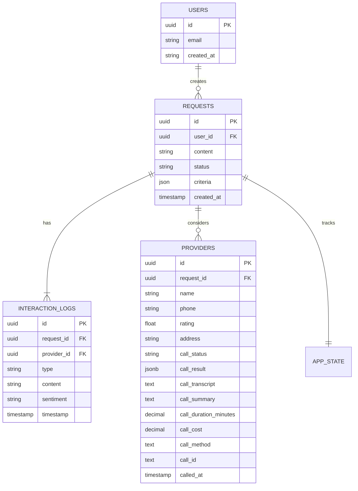

### Request Status Flow

The `RECOMMENDED` status was added in December 2025 to clearly separate the analysis phase from user decision time.

**Complete Status Enum** (`apps/web/lib/types/index.ts`):

```typescript
export enum RequestStatus {
  PENDING = "PENDING",       // Request created
  SEARCHING = "SEARCHING",   // Researching providers
  CALLING = "CALLING",       // Making VAPI calls
  ANALYZING = "ANALYZING",   // Processing call results
  RECOMMENDED = "RECOMMENDED", // NEW: Top 3 ready for user selection
  BOOKING = "BOOKING",       // Scheduling appointment
  COMPLETED = "COMPLETED",   // Appointment confirmed
  FAILED = "FAILED",         // Error state
}
```

**Status Flow Diagram**:

```
PENDING → SEARCHING → CALLING → ANALYZING → RECOMMENDED → BOOKING → COMPLETED
                                    ↓              ↓
                                 FAILED        CANCELLED
```

**Critical Transition: ANALYZING → RECOMMENDED**

This transition is **backend-owned** and occurs when:
1. All provider calls have completed (success, failed, or timeout)
2. Backend has generated AI recommendations via Kestra or Gemini
3. Top 3 providers are scored and ranked with reasoning

The frontend simply **observes** this status change via Supabase Realtime and displays the recommendations.

### Provider Persistence Architecture (December 2025)

This section documents the database-first pattern for provider persistence, which ensures proper UUID-based tracking through the entire call lifecycle.

#### The Problem Solved

Previously, providers from research used Google Place IDs (e.g., `ChIJRURMfy-gVogRtM_hIBmcucM`) as their identifiers. These IDs:
- Were never persisted to the database
- Failed UUID validation in `CallResultService`
- Prevented call results from being saved to provider records
- Broke Supabase real-time subscriptions (no DB changes to trigger)

#### The Solution: Database-First Pattern

Providers are now INSERT-ed into the database **immediately after research completes**, before any VAPI calls are made. This generates proper UUIDs that flow through the entire system.

```mermaid
flowchart TD
    subgraph Research Phase
        A[User submits request] --> B[searchProvidersWorkflow]
        B --> C{Kestra or Direct?}
        C -->|Kestra| D[Kestra Research Flow]
        C -->|Direct| E[Direct Gemini + Maps]
        D --> F[Provider[] with Place IDs]
        E --> F
    end

    subgraph Persistence Phase
        F --> G[addProviders Server Action]
        G --> H[(Supabase INSERT)]
        H --> I[Returns records with UUIDs]
    end

    subgraph Calling Phase
        I --> J[callProviderLive with UUID]
        J --> K[VAPI Call + UUID in metadata]
        K --> L{Webhook or Polling?}
        L -->|Webhook| M[Webhook extracts UUID]
        L -->|Polling| N[Direct poll completes]
        M --> O[CallResultService.saveCallResult]
        N --> O
        O --> P[(UPDATE providers SET call_result...)]
    end

    subgraph Real-time Phase
        P --> Q[Supabase triggers change]
        Q --> R[Frontend subscription fires]
        R --> S[UI updates automatically]
    end

    style G fill:#4a90e2,color:#fff
    style H fill:#7bed9f,color:#000
    style I fill:#7bed9f,color:#000
    style P fill:#7bed9f,color:#000
```

#### Key Implementation Details

**1. Provider Insertion** (`apps/web/app/new/page.tsx`):

```typescript
// After research completes, INSERT providers into database
const providerInserts = workflowResult.providers.map((p) => ({
  request_id: reqId,
  name: p.name,
  phone: p.phone || null,
  rating: p.rating || null,
  address: p.address || null,
  source: "Google Maps" as const,
  place_id: p.placeId || p.id || null,  // Store Google Place ID for reference
  review_count: p.reviewCount || null,
  distance: p.distance || null,
  // ... other enrichment data
}));

// Database generates UUIDs automatically
const dbProviders = await addProviders(providerInserts);

// Use database UUIDs for all subsequent operations
providers = dbProviders.map((dbp) => ({
  id: dbp.id,  // Database UUID - NOT Google Place ID
  name: dbp.name,
  placeId: dbp.place_id,  // Keep Place ID for reference only
  // ...
}));
```

**2. UUID in VAPI Metadata** (`apps/api/src/services/vapi/webhook-config.ts`):

```typescript
export function createWebhookMetadata(request: CallRequest) {
  return {
    providerId: request.providerId || "",  // Database UUID
    serviceRequestId: request.serviceRequestId || "",
    providerName: request.providerName,
    // ...
  };
}
```

**3. UUID Validation** (`apps/api/src/services/vapi/call-result.service.ts`):

```typescript
// Only update if providerId is a valid UUID
if (request.providerId && isValidUuid(request.providerId)) {
  await this.updateProvider(request.providerId, result);
} else if (request.providerId) {
  // Non-UUID IDs (e.g., "task-123" for Direct Tasks) are logged and skipped
  this.logger.info({ providerId }, "Skipping - non-UUID ID");
}
```

#### Coverage: Both Kestra and Direct API Paths

This fix covers **both** research paths because:

1. **Unified Frontend**: `searchProvidersWorkflow()` abstracts both Kestra and Direct Gemini backends
2. **Single Insertion Point**: `addProviders()` is called regardless of research method
3. **Same Provider[] Interface**: Both backends return the same `ResearchResult` structure

| Research Path | ID Before Fix | ID After Fix |
|---------------|---------------|--------------|
| Kestra | `kestra-1733800000-0` | UUID from database |
| Direct Gemini (Places) | `ChIJ0Y...` (Place ID) | UUID from database |
| Direct Gemini (Maps) | `gemini-maps-1733800000-0` | UUID from database |
| Direct Gemini (JSON) | `gemini-json-1733800000-0` | UUID from database |

#### Data Flow Summary

| Step | Component | ID Type | Purpose |
|------|-----------|---------|---------|
| 1 | Research API | Place ID / Temp ID | Initial search results |
| 2 | `addProviders()` | **UUID generated** | Database persistence |
| 3 | `callProviderLive()` | UUID | VAPI call request |
| 4 | VAPI Metadata | UUID | Travels with call |
| 5 | Webhook/Polling | UUID | Extracted from metadata |
| 6 | `CallResultService` | UUID | Database UPDATE query |
| 7 | Real-time Sub | UUID | Triggers on provider update |

#### Benefits

1. **Call Results Persist**: `CallResultService.updateProvider()` can find and update provider records
2. **Real-time Works**: Supabase subscriptions trigger on actual database changes
3. **Foreign Keys Valid**: `selected_provider_id` references work correctly
4. **Audit Trail**: Complete history of provider research → calling → selection

### Call Tracking Columns (providers table)

| Column                  | Type        | Description                                                                     |
| ----------------------- | ----------- | ------------------------------------------------------------------------------- |
| `call_status`           | TEXT        | Current call state (queued, ringing, in-progress, ended, error)                 |
| `call_result`           | JSONB       | Structured analysis (availability, rate, criteria_met, etc.) - see schema below |
| `call_transcript`       | TEXT        | Full conversation transcript                                                    |
| `call_summary`          | TEXT        | AI-generated summary                                                            |
| `call_duration_minutes` | DECIMAL     | Call length                                                                     |
| `call_cost`             | DECIMAL     | VAPI cost                                                                       |
| `call_method`           | TEXT        | 'kestra' or 'direct_vapi'                                                       |
| `call_id`               | TEXT        | VAPI call ID for reference                                                      |
| `called_at`             | TIMESTAMPTZ | When call was initiated                                                         |

### Call Result Schema (JSONB Structure)

The `call_result` column contains structured data captured by the VAPI assistant:

```typescript
// Stored in providers.call_result (JSONB)
{
  // Availability Information
  availability: "available" | "unavailable" | "callback_requested" | "unclear",
  earliest_availability: string,  // NEW: "Tomorrow at 2pm", "Friday morning", etc.

  // Pricing
  estimated_rate: string,

  // Single Person Tracking
  single_person_found: boolean,
  technician_name?: string,

  // Criteria Validation
  all_criteria_met: boolean,
  criteria_details: {
    // Dynamic object based on user criteria
    // Example: { "licensed": true, "10_years_experience": true }
  },

  // Disqualification Tracking (NEW)
  disqualified: boolean,              // NEW: Was provider disqualified?
  disqualification_reason?: string,   // NEW: Why they were disqualified

  // Call Outcome
  call_outcome: "positive" | "negative" | "neutral" | "no_answer" | "voicemail",
  recommended: boolean,
  notes: string
}
```

**New Fields Explained:**

- **`earliest_availability`**: Captures the specific date/time the provider mentioned (e.g., "Tomorrow at 2pm", "Friday morning", "Next Monday")
- **`disqualified`**: Boolean flag indicating whether the provider was disqualified during the call
- **`disqualification_reason`**: Text explanation of why they were disqualified (e.g., "Not available within timeframe", "Does not have licensed technician", "Rate too high")

**Usage Example:**

```sql
-- Find all disqualified providers
SELECT name, call_result->>'disqualification_reason'
FROM providers
WHERE call_result->>'disqualified' = 'true';

-- Find providers available tomorrow
SELECT name, call_result->>'earliest_availability'
FROM providers
WHERE call_result->>'availability' = 'available'
  AND call_result->>'earliest_availability' ILIKE '%tomorrow%';
```

---

## 6. Production Deployment Architecture

### Railway (Production - Hybrid Webhook Mode)

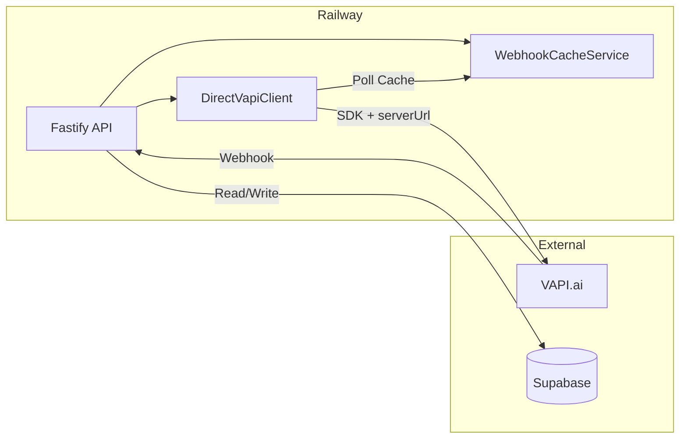

**Configuration (Recommended - Hybrid Mode):**

```bash
KESTRA_ENABLED=false
VAPI_API_KEY=your-prod-key
VAPI_PHONE_NUMBER_ID=your-prod-phone-id
VAPI_WEBHOOK_URL=https://your-railway-app.railway.app/api/v1/vapi/webhook
BACKEND_URL=https://your-railway-app.railway.app
```

**Hybrid Mode Benefits in Production:**
- VAPI sends call results via webhook immediately on completion
- DirectVapiClient polls the backend cache (not VAPI API)
- 31x fewer external API calls, <500ms latency
- Automatic fallback to VAPI polling if webhook times out

### Local Development (Polling Only)

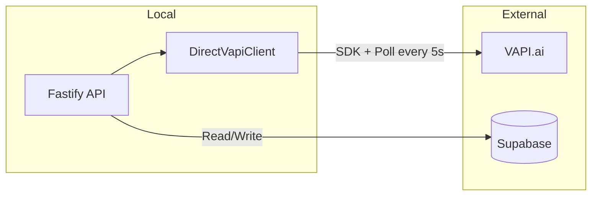

**Configuration (No ngrok):**

```bash
KESTRA_ENABLED=false
VAPI_API_KEY=your-dev-key
VAPI_PHONE_NUMBER_ID=your-dev-phone-id
# VAPI_WEBHOOK_URL not set - uses polling only
```

### Local Development with ngrok (Hybrid Mode)

```bash
KESTRA_ENABLED=false
VAPI_API_KEY=your-dev-key
VAPI_PHONE_NUMBER_ID=your-dev-phone-id
VAPI_WEBHOOK_URL=https://your-id.ngrok-free.app/api/v1/vapi/webhook
BACKEND_URL=http://localhost:8000
```

### Local/Staging (With Kestra)

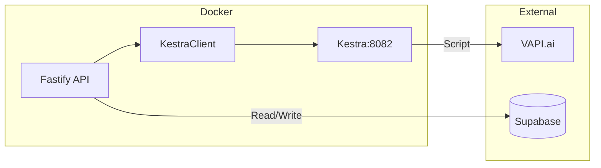

**Configuration:**

```bash
KESTRA_ENABLED=true
KESTRA_URL=http://localhost:8082
```
