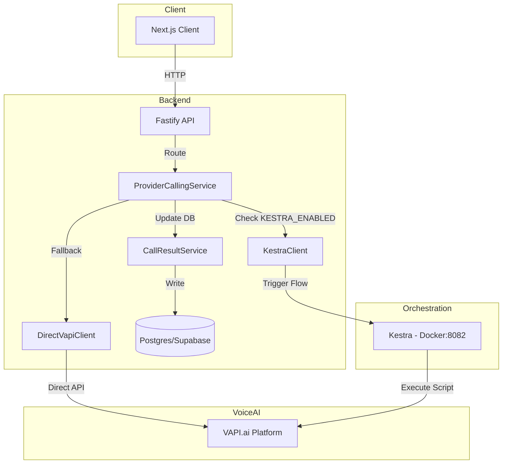
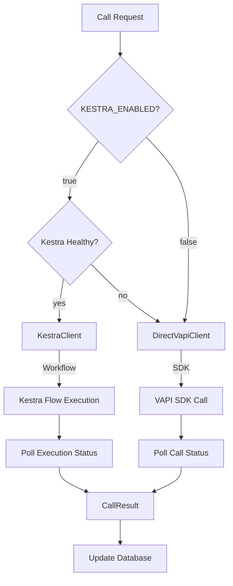
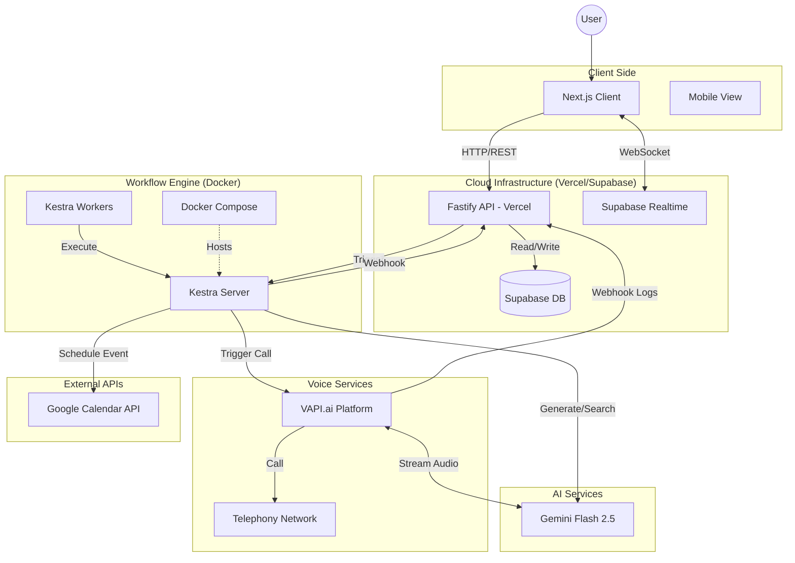
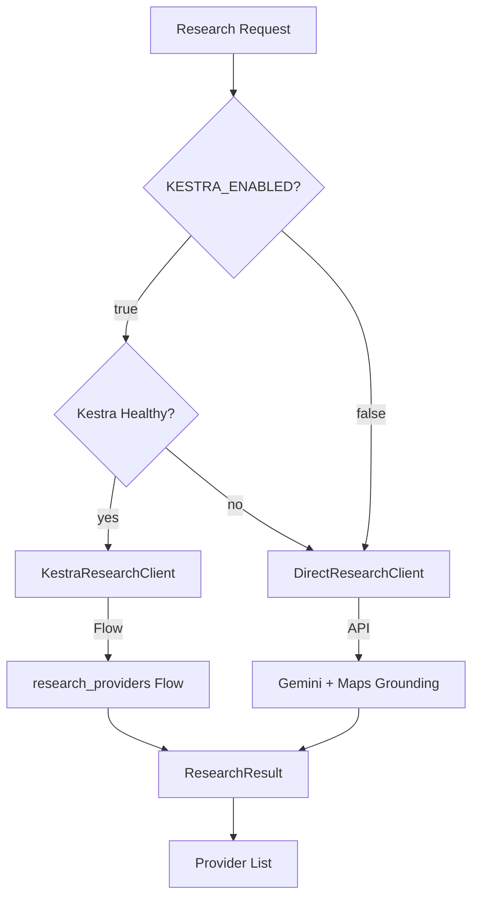
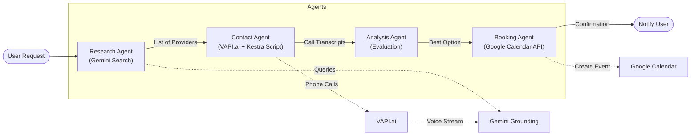
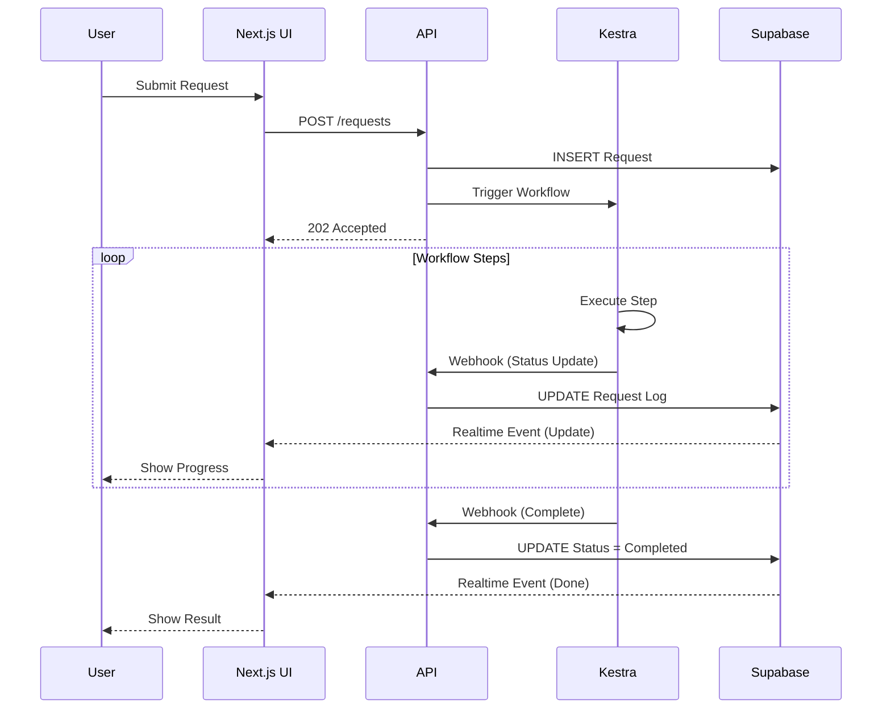
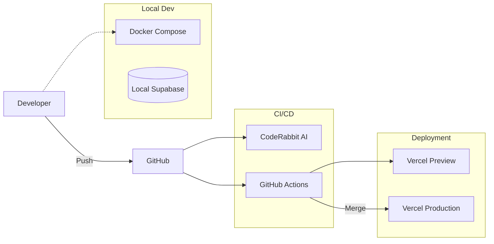
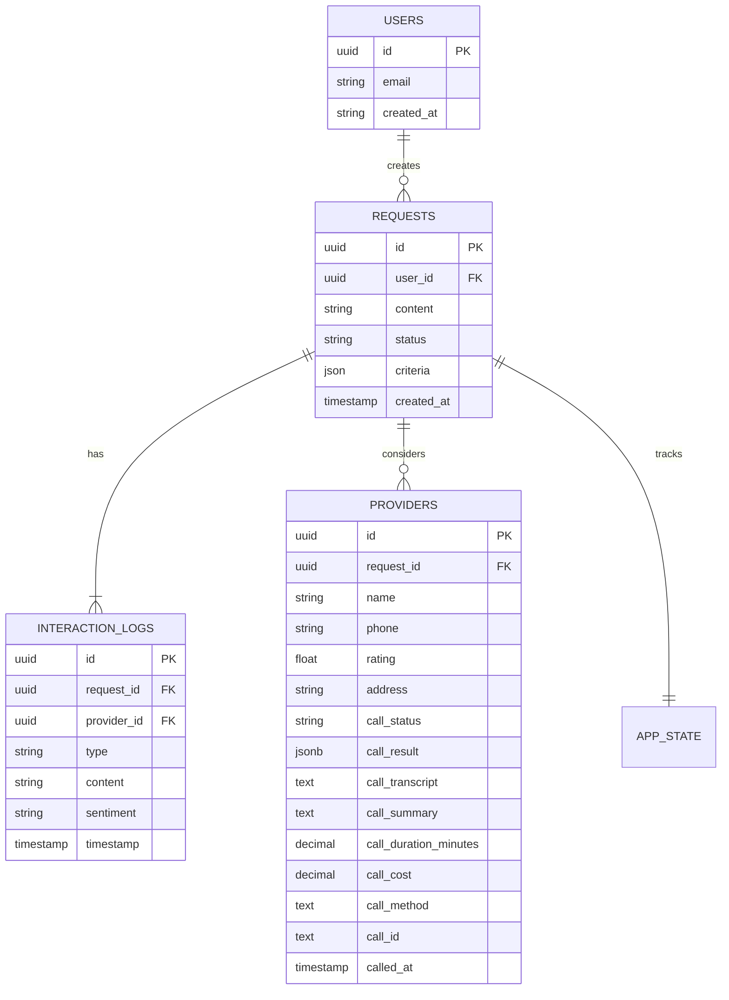
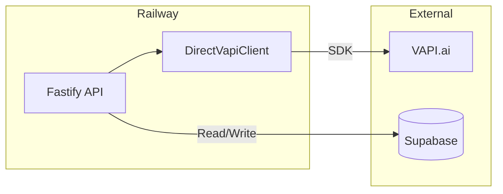
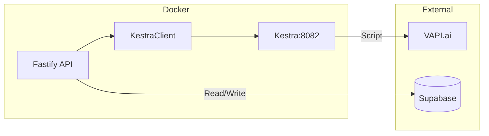

# Architecture Diagrams

## 1. High-Level System Architecture

### Current State (Day 3+)
The system now features a **VAPI Fallback Architecture** that automatically detects Kestra availability and routes phone calls appropriately. This enables production deployment on Railway (without Kestra) using direct VAPI API calls.



### VAPI Fallback Decision Flow


### Target State (End of Day 5) (Target State)
This diagram illustrates the complete system architecture including the new Kestra orchestration and Cline automation components.



## 2. Provider Calling Service Architecture

### Service Layer (`apps/api/src/services/vapi/`)

| File | Purpose |
|------|---------|
| `types.ts` | Shared type definitions (CallRequest, CallResult, StructuredCallData) |
| `assistant-config.ts` | VAPI assistant configuration (mirrors Kestra's call-provider.js) |
| `direct-vapi.client.ts` | Direct VAPI SDK integration with polling |
| `kestra.client.ts` | Kestra workflow trigger and status polling |
| `call-result.service.ts` | Database updates for providers and interaction_logs |
| `provider-calling.service.ts` | Main orchestrator (routes between Kestra/DirectVAPI) |
| `index.ts` | Service exports |

### API Endpoints

| Endpoint | Method | Purpose |
|----------|--------|---------|
| `/api/v1/providers/call` | POST | Initiate phone call to provider |
| `/api/v1/providers/call/status` | GET | Check system status (active method, health) |

### Environment Configuration

```bash
# Kestra Configuration
KESTRA_ENABLED=false              # Set true for local/staging with Kestra
KESTRA_URL=http://localhost:8082
KESTRA_NAMESPACE=ai_concierge
KESTRA_HEALTH_CHECK_TIMEOUT=3000

# VAPI Configuration
VAPI_API_KEY=your-key
VAPI_PHONE_NUMBER_ID=your-phone-id
```

---

## 3. Kestra Workflow Logic (The "Brain")

### Current State
Individual flows exist and are now callable via fallback services when Kestra is unavailable.

- `research_agent.yaml`: Functional (Gemini Search) - **Now with Direct Gemini fallback via ResearchService**.
- `contact_agent.yaml`: Functional (VAPI Script) - **Now with Direct VAPI fallback via ProviderCallingService**.
- `booking_agent.yaml`: Functional (GCal Script).

### Research Agent Fallback Flow


### Target State
The core "Concierge" agentic workflow.



## 3. Data Flow & Real-Time Updates
How the user gets feedback without reloading.



## 4. Infrastructure & DevOps Pipeline
The CI/CD process for the team.



## 5. Domain Model (ER Diagram)
The database schema supporting the application.



### Call Tracking Columns (providers table)

| Column | Type | Description |
|--------|------|-------------|
| `call_status` | TEXT | Current call state (queued, ringing, in-progress, ended, error) |
| `call_result` | JSONB | Structured analysis (availability, rate, criteria_met, etc.) |
| `call_transcript` | TEXT | Full conversation transcript |
| `call_summary` | TEXT | AI-generated summary |
| `call_duration_minutes` | DECIMAL | Call length |
| `call_cost` | DECIMAL | VAPI cost |
| `call_method` | TEXT | 'kestra' or 'direct_vapi' |
| `call_id` | TEXT | VAPI call ID for reference |
| `called_at` | TIMESTAMPTZ | When call was initiated |

---

## 6. Production Deployment Architecture

### Railway (Production - No Kestra)


**Configuration:**
```bash
KESTRA_ENABLED=false
VAPI_API_KEY=your-prod-key
VAPI_PHONE_NUMBER_ID=your-prod-phone-id
```

### Local/Staging (With Kestra)


**Configuration:**
```bash
KESTRA_ENABLED=true
KESTRA_URL=http://localhost:8082
```
