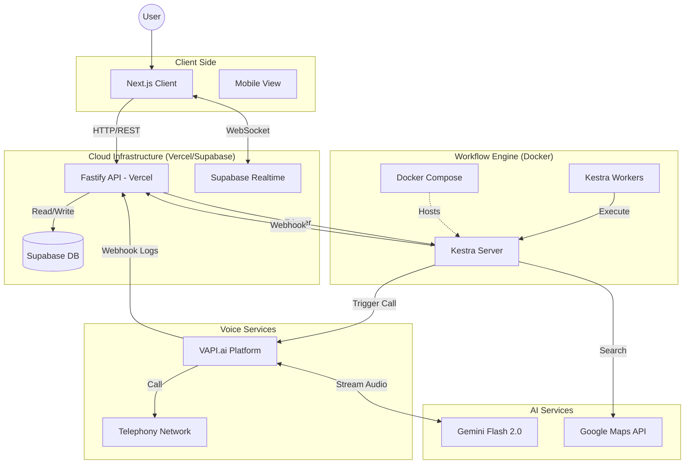
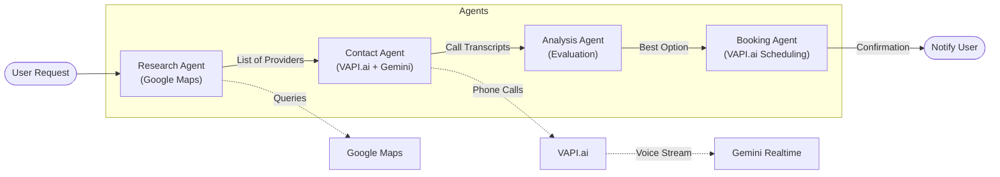
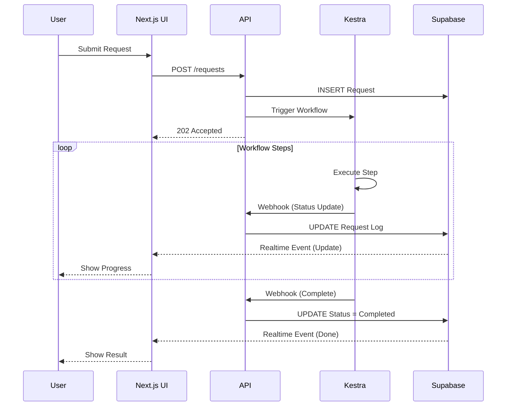
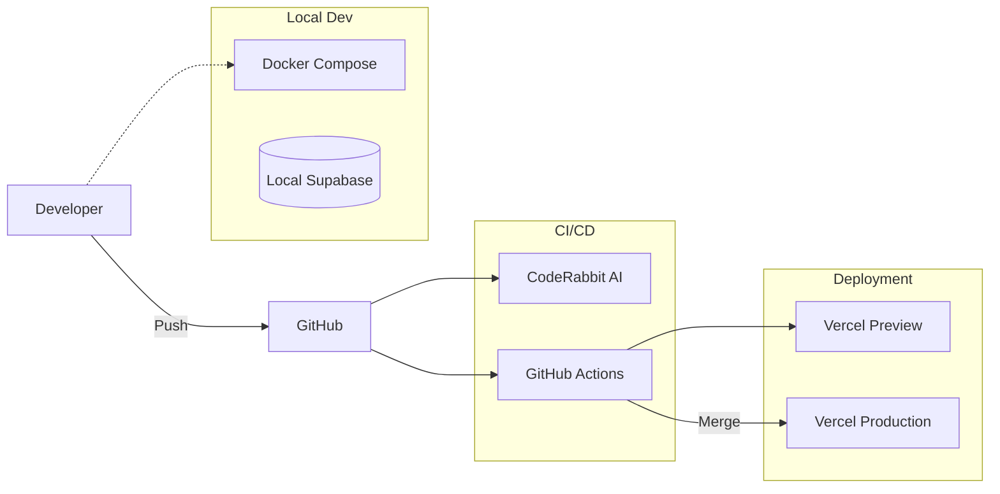
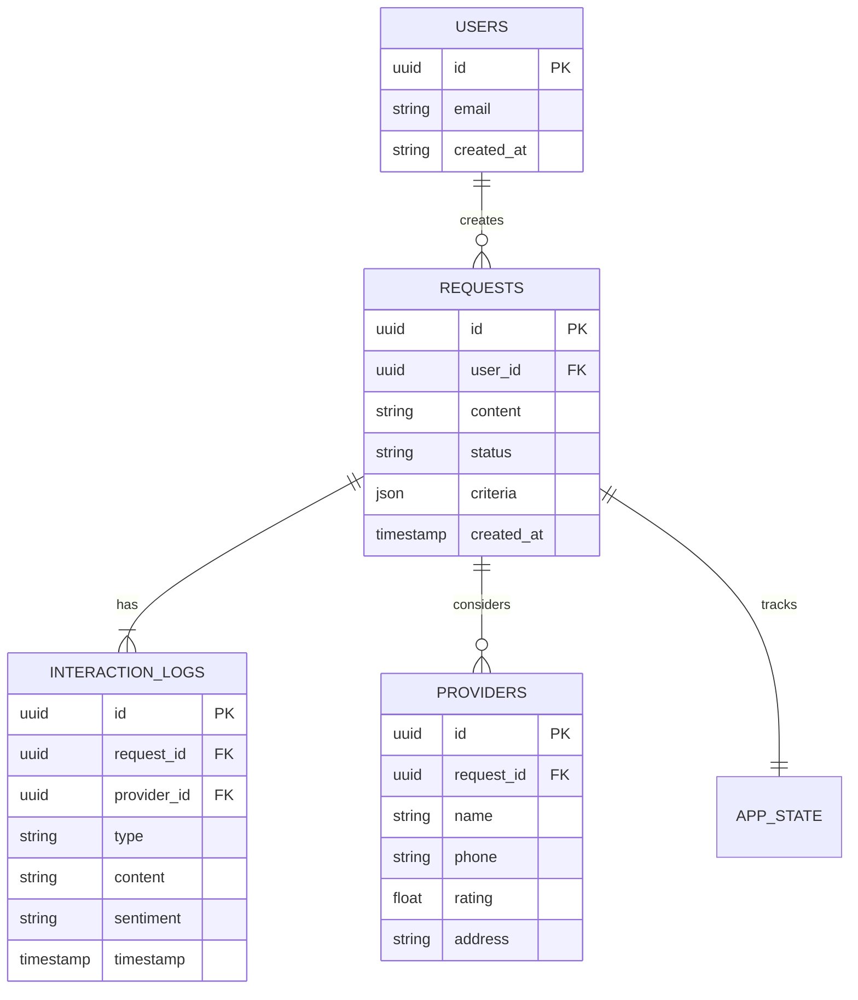

# Architecture Diagrams

## 1. High-Level System Architecture (Target State)
This diagram illustrates the complete system architecture including the new Kestra orchestration and Cline automation components.

## 2. Kestra Workflow Logic (The "Brain")
The core "Concierge" agentic workflow.

## 3. Data Flow & Real-Time Updates
How the user gets feedback without reloading.

## 4. Infrastructure & DevOps Pipeline
The CI/CD process for the team.

## 5. Domain Model (ER Diagram)
The database schema supporting the application.

