# Architecture Diagrams

## Recent Architecture Updates (December 2025)

The VAPI calling system has undergone significant architectural improvements implementing DRY principles and intelligent call handling:

### Key Changes:

1. **Single Source of Truth (DRY Principle)**
   - `apps/api/src/services/vapi/assistant-config.ts` is now THE authoritative source for VAPI assistant behavior
   - Eliminated ~467 lines of duplicated code across 3 files
   - Kestra scripts dynamically import from compiled TypeScript output
   - Guaranteed consistency between Direct VAPI and Kestra execution paths

2. **Intelligent Disqualification Logic**
   - AI actively detects when providers cannot meet requirements during calls
   - Conditional closing scripts: callback mention ONLY for qualified providers
   - Polite exit script for disqualified providers (no scheduling mention)
   - Captures disqualification reason for analytics and debugging

3. **Enhanced Structured Data**
   - **New Field**: `earliest_availability` - Specific date/time provider can come out
   - **New Field**: `disqualified` - Boolean flag for provider qualification status
   - **New Field**: `disqualification_reason` - Explanation of why provider was disqualified
   - Enables better provider ranking and filtering

4. **TypeScript as Source of Truth**
   - Type-safe configuration with IDE support
   - JavaScript Kestra scripts import from `apps/api/dist/`
   - Build required before running Kestra: `pnpm build`
   - Runtime validation ensures correct structure across all consumers

**Impact**: More maintainable codebase, consistent call behavior, and richer data capture for better provider selection.

---

## 1. High-Level System Architecture

### Current State (Day 3+)

The system now features a **VAPI Fallback Architecture** that automatically detects Kestra availability and routes phone calls appropriately. This enables production deployment on Railway (without Kestra) using direct VAPI API calls.

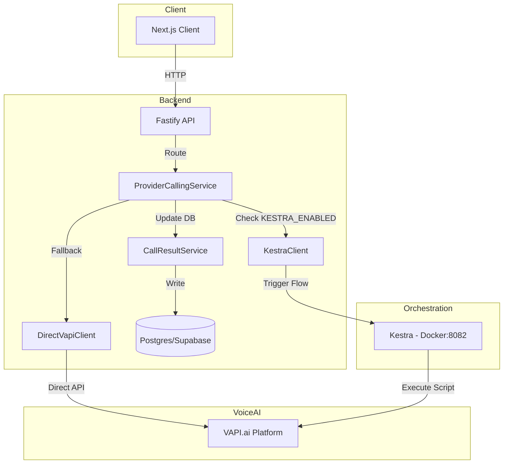

### VAPI Fallback Decision Flow

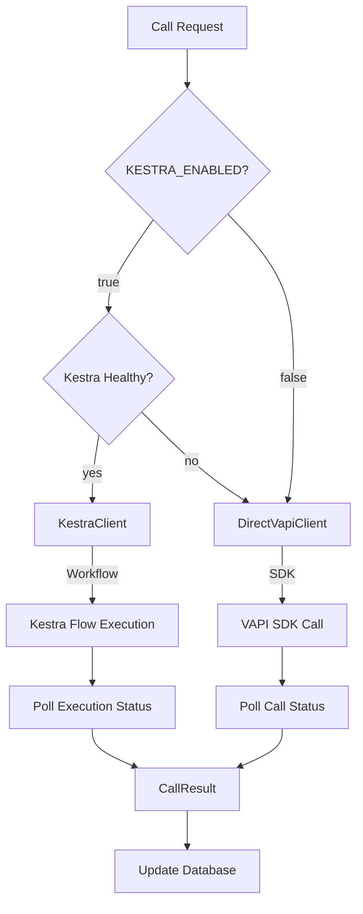

### Target State (End of Day 5) (Target State)

This diagram illustrates the complete system architecture including the new Kestra orchestration and Cline automation components.

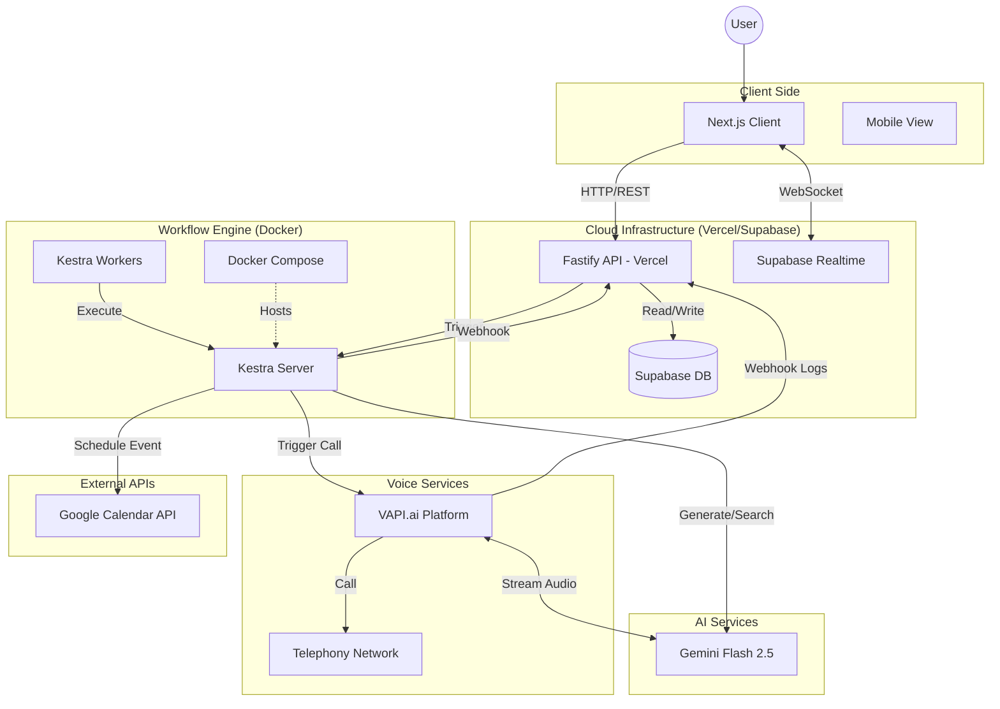

## 2. Provider Calling Service Architecture

### Service Layer (`apps/api/src/services/vapi/`)

| File                          | Purpose                                                               |
| ----------------------------- | --------------------------------------------------------------------- |
| `types.ts`                    | Shared type definitions (CallRequest, CallResult, StructuredCallData) |
| `assistant-config.ts`         | VAPI assistant configuration (mirrors Kestra's call-provider.js)      |
| `direct-vapi.client.ts`       | Direct VAPI SDK integration with polling                              |
| `kestra.client.ts`            | Kestra workflow trigger and status polling                            |
| `call-result.service.ts`      | Database updates for providers and interaction_logs                   |
| `provider-calling.service.ts` | Main orchestrator (routes between Kestra/DirectVAPI)                  |
| `index.ts`                    | Service exports                                                       |

### VAPI Assistant Configuration (Single Source of Truth)

**File**: `/apps/api/src/services/vapi/assistant-config.ts`

This file is the **single source of truth** for VAPI assistant behavior. Both Direct VAPI and Kestra paths use this configuration to ensure identical call behavior, implementing the DRY (Don't Repeat Yourself) principle.

#### Architecture Benefits:

- **~467 lines of duplicated code eliminated** - Configuration defined once, used everywhere
- **Consistent behavior** - Direct VAPI and Kestra paths produce identical calls
- **TypeScript as source of truth** - Type safety and IDE support for configuration
- **Kestra scripts import from compiled dist** - JavaScript scripts load from `apps/api/dist/services/vapi/assistant-config.js`

#### Build Requirement:

Before running Kestra scripts, the API must be built to compile TypeScript:

```bash
pnpm build  # or pnpm --filter api build
```

#### Key Features:

**1. Disqualification Detection & Handling**

The assistant actively detects during calls when a provider cannot meet requirements:

- **Unavailability** - Provider not available within required timeframe
- **Criteria not met** - Cannot satisfy specific client requirements
- **Unreasonable rates** - Pricing significantly higher than market
- **Wrong service type** - Doesn't perform the type of work needed

When disqualified, uses polite exit script:

```
"Thank you so much for taking the time to chat. Unfortunately, it sounds like
this particular request might not be the best fit right now, but I really
appreciate your help. Have a wonderful day!"
```

**No mention of scheduling or callbacks** - clear termination

**2. Conditional Closing Logic**

The assistant adapts its closing based on provider qualification:

| Condition            | Closing Script                                                                                                                                                         | Callback Mentioned? |
| -------------------- | ---------------------------------------------------------------------------------------------------------------------------------------------------------------------- | ------------------- |
| **All criteria met** | "Perfect, thank you so much for all that information! Once I confirm with my client, if they decide to proceed, I'll call you back to schedule. Does that sound good?" | YES                 |
| **Disqualified**     | Polite exit script (see above)                                                                                                                                         | NO                  |

**3. Structured Data Schema**

The assistant captures comprehensive data from each call:

```typescript
{
  // Existing fields
  availability: "available" | "unavailable" | "callback_requested" | "unclear",
  estimated_rate: string,
  single_person_found: boolean,
  technician_name?: string,
  all_criteria_met: boolean,
  criteria_details: object,
  call_outcome: "positive" | "negative" | "neutral" | "no_answer" | "voicemail",
  recommended: boolean,
  notes: string,

  // NEW FIELDS for disqualification tracking
  earliest_availability: string,        // "Tomorrow at 2pm", "Friday morning", etc.
  disqualified: boolean,                // Was provider disqualified?
  disqualification_reason?: string      // Why they were disqualified
}
```

**4. Single Person Requirement Enforcement**

The assistant ensures all criteria apply to **one single person**, not multiple technicians:

- First question: "Do you have a technician who [first requirement]?"
- Follow-ups: "And is this **same person** also [next requirement]?"
- Continuous reference: "The technician you mentioned - are they also [requirement]?"

This prevents providers from offering different people for different requirements.

#### Configuration Usage:

**TypeScript/API (Direct VAPI):**

```typescript
import { createAssistantConfig } from './assistant-config.js';

const config = createAssistantConfig({
  phoneNumber: "+1234567890",
  serviceNeeded: "plumbing",
  userCriteria: "Licensed, 10+ years experience",
  location: "Greenville, SC",
  providerName: "ABC Plumbing",
  urgency: "within_2_days"
});

// Use with VAPI SDK
await vapi.calls.create({ assistant: config, ... });
```

**JavaScript/Kestra (Imported from compiled dist):**

```javascript
// Kestra script imports from compiled TypeScript
const { createAssistantConfig } = await import(
  '../../apps/api/dist/services/vapi/assistant-config.js'
);

const config = createAssistantConfig(callRequest);
await vapi.calls.create({ assistant: config, ... });
```

### Call Flow with Disqualification Logic

This diagram shows how the VAPI assistant handles provider calls with intelligent disqualification detection:

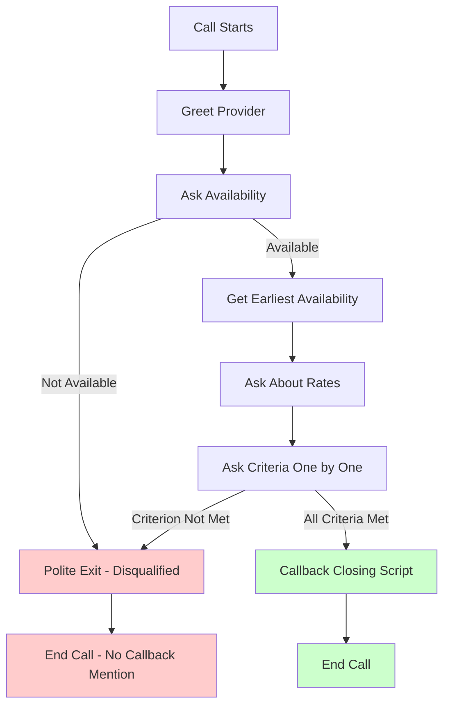

**Key Decision Points:**

1. **Availability Check** - First gate: if unavailable, immediate polite exit
2. **Earliest Availability** - If available, capture specific date/time
3. **Rate Check** - Gather pricing information
4. **Criteria Validation** - Each criterion checked sequentially for the SAME person
5. **Conditional Closing** - Different scripts for qualified vs disqualified providers

**Data Captured:**

- ✅ Qualified: `disqualified: false`, uses callback closing, captures all criteria details
- ❌ Disqualified: `disqualified: true`, `disqualification_reason: string`, polite exit only

### API Endpoints

| Endpoint                        | Method | Purpose                                     |
| ------------------------------- | ------ | ------------------------------------------- |
| `/api/v1/providers/call`        | POST   | Initiate phone call to provider             |
| `/api/v1/providers/call/status` | GET    | Check system status (active method, health) |

### Environment Configuration

```bash
# Kestra Configuration
KESTRA_ENABLED=false              # Set true for local/staging with Kestra
KESTRA_URL=http://localhost:8082
KESTRA_NAMESPACE=ai_concierge
KESTRA_HEALTH_CHECK_TIMEOUT=3000

# VAPI Configuration
VAPI_API_KEY=your-key
VAPI_PHONE_NUMBER_ID=your-phone-id
```

### DRY Architecture: Shared Configuration Between API and Kestra

The VAPI assistant configuration demonstrates a sophisticated DRY (Don't Repeat Yourself) architecture that eliminates code duplication between TypeScript API services and JavaScript Kestra scripts.

#### Problem Solved:

Previously, the same VAPI assistant configuration existed in multiple places:

- `apps/api/src/services/vapi/assistant-config.ts` (TypeScript)
- `kestra/scripts/call-provider.js` (JavaScript - duplicated logic)
- `kestra/scripts/call-provider-webhook.js` (JavaScript - duplicated logic)

This resulted in:

- **~467 lines of duplicated code**
- **Maintenance burden** - changes had to be made in 3 places
- **Inconsistency risk** - configurations could drift out of sync
- **No type safety** in JavaScript duplicates

#### Solution: TypeScript as Single Source of Truth

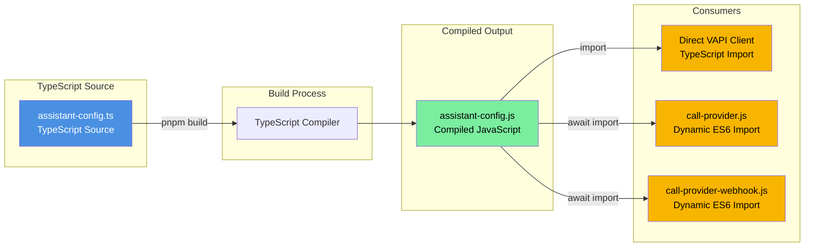

#### Implementation Details:

**1. TypeScript Source (Single Source of Truth):**

```typescript
// apps/api/src/services/vapi/assistant-config.ts
export function createAssistantConfig(request: CallRequest) {
  return {
    name: `Concierge-${Date.now()}`,
    voice: { provider: "11labs", voiceId: "..." },
    model: { provider: "google", model: "gemini-2.0-flash-exp" },
    analysisPlan: {
      structuredDataPlan: {
        schema: {
          properties: {
            disqualified: { type: "boolean" },
            disqualification_reason: { type: "string" },
            earliest_availability: { type: "string" },
            // ... all other fields
          },
        },
      },
    },
  };
}
```

**2. TypeScript Build Output:**

```bash
# Build command compiles TypeScript to JavaScript
pnpm build  # or pnpm --filter api build

# Output location:
apps/api/dist/services/vapi/assistant-config.js  # ES6 module
```

**3. TypeScript Consumer (Direct VAPI):**

```typescript
// apps/api/src/services/vapi/direct-vapi.client.ts
import { createAssistantConfig } from "./assistant-config.js";

const config = createAssistantConfig(callRequest);
await this.vapi.calls.create({ assistant: config });
```

**4. JavaScript Consumer (Kestra Scripts):**

```javascript
// kestra/scripts/call-provider.js
let createAssistantConfig;

async function loadAssistantConfig() {
  try {
    // Dynamic import from compiled TypeScript output
    const configModule = await import(
      "../../apps/api/dist/services/vapi/assistant-config.js"
    );
    createAssistantConfig = configModule.createAssistantConfig;
    console.log("[Config] Loaded shared configuration from TypeScript source");
  } catch (error) {
    console.error("[Config] Make sure the API has been built: pnpm build");
    process.exit(1);
  }
}

// Usage
await loadAssistantConfig();
const config = createAssistantConfig(callRequest);
await vapi.calls.create({ assistant: config });
```

#### Key Technical Points:

**ES6 Dynamic Import from CommonJS:**

- Kestra scripts use CommonJS (`require`)
- TypeScript compiles to ES6 modules (`export`)
- `await import()` allows CommonJS to load ES6 modules dynamically

**Build Dependency:**

- Kestra scripts **require** the API to be built first
- Error message directs developers to run `pnpm build`
- CI/CD must ensure build happens before Kestra deployments

**Type Safety Benefits:**

- Configuration defined with TypeScript types
- IDE autocomplete and validation in TypeScript code
- Runtime validation ensures JavaScript consumers get correct structure

#### Architecture Benefits:

| Aspect        | Before (Duplicated)                | After (DRY)                    |
| ------------- | ---------------------------------- | ------------------------------ |
| Lines of Code | ~467 lines × 3 files = 1,401 lines | 267 lines × 1 file = 267 lines |
| Maintenance   | Update 3 files                     | Update 1 file                  |
| Consistency   | Manual sync required               | Guaranteed identical           |
| Type Safety   | Only in TypeScript                 | Source has types               |
| Risk of Drift | High                               | Zero                           |

---

## 3. Kestra Workflow Logic (The "Brain")

### Current State

Individual flows exist and are now callable via fallback services when Kestra is unavailable.

- `research_agent.yaml`: Functional (Gemini Search) - **Now with Direct Gemini fallback via ResearchService**.
- `contact_agent.yaml`: Functional (VAPI Script) - **Now with Direct VAPI fallback via ProviderCallingService**.
- `booking_agent.yaml`: Functional (GCal Script).

### Research Agent Fallback Flow

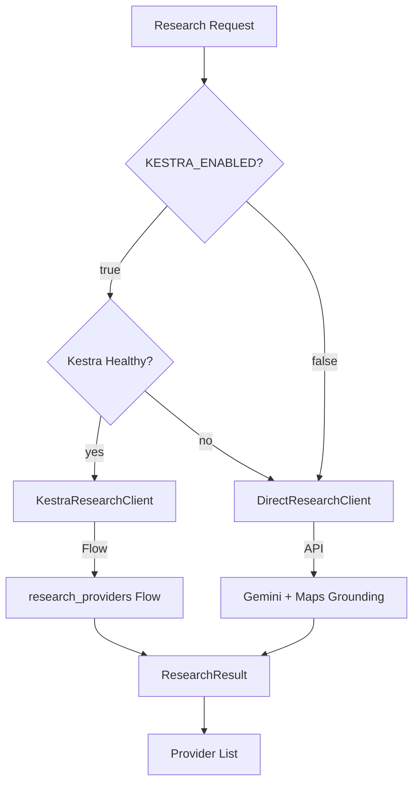

### Target State

The core "Concierge" agentic workflow.


## 3. Data Flow & Real-Time Updates

How the user gets feedback without reloading.

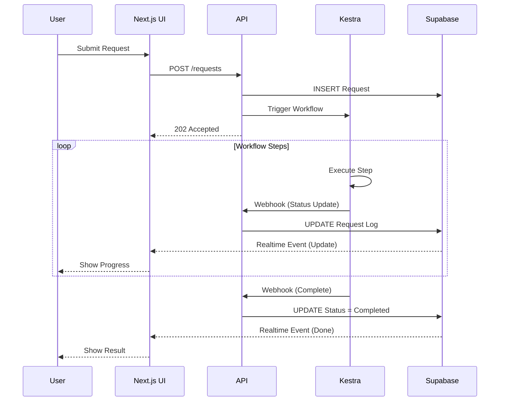

## 4. Infrastructure & DevOps Pipeline

The CI/CD process for the team.

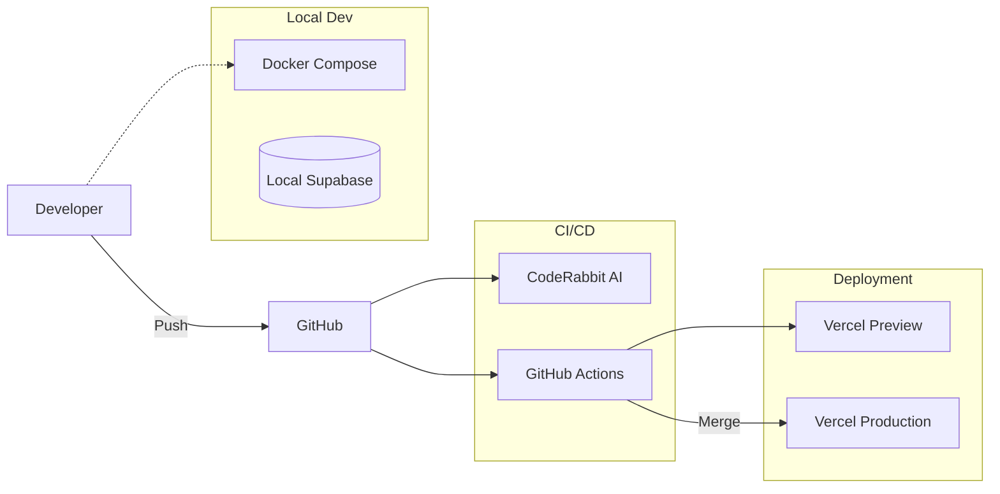

## 5. Domain Model (ER Diagram)

The database schema supporting the application.

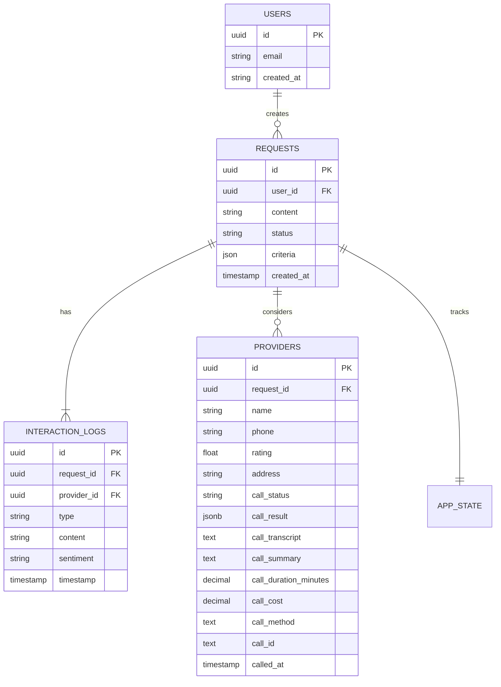

### Call Tracking Columns (providers table)

| Column                  | Type        | Description                                                                     |
| ----------------------- | ----------- | ------------------------------------------------------------------------------- |
| `call_status`           | TEXT        | Current call state (queued, ringing, in-progress, ended, error)                 |
| `call_result`           | JSONB       | Structured analysis (availability, rate, criteria_met, etc.) - see schema below |
| `call_transcript`       | TEXT        | Full conversation transcript                                                    |
| `call_summary`          | TEXT        | AI-generated summary                                                            |
| `call_duration_minutes` | DECIMAL     | Call length                                                                     |
| `call_cost`             | DECIMAL     | VAPI cost                                                                       |
| `call_method`           | TEXT        | 'kestra' or 'direct_vapi'                                                       |
| `call_id`               | TEXT        | VAPI call ID for reference                                                      |
| `called_at`             | TIMESTAMPTZ | When call was initiated                                                         |

### Call Result Schema (JSONB Structure)

The `call_result` column contains structured data captured by the VAPI assistant:

```typescript
// Stored in providers.call_result (JSONB)
{
  // Availability Information
  availability: "available" | "unavailable" | "callback_requested" | "unclear",
  earliest_availability: string,  // NEW: "Tomorrow at 2pm", "Friday morning", etc.

  // Pricing
  estimated_rate: string,

  // Single Person Tracking
  single_person_found: boolean,
  technician_name?: string,

  // Criteria Validation
  all_criteria_met: boolean,
  criteria_details: {
    // Dynamic object based on user criteria
    // Example: { "licensed": true, "10_years_experience": true }
  },

  // Disqualification Tracking (NEW)
  disqualified: boolean,              // NEW: Was provider disqualified?
  disqualification_reason?: string,   // NEW: Why they were disqualified

  // Call Outcome
  call_outcome: "positive" | "negative" | "neutral" | "no_answer" | "voicemail",
  recommended: boolean,
  notes: string
}
```

**New Fields Explained:**

- **`earliest_availability`**: Captures the specific date/time the provider mentioned (e.g., "Tomorrow at 2pm", "Friday morning", "Next Monday")
- **`disqualified`**: Boolean flag indicating whether the provider was disqualified during the call
- **`disqualification_reason`**: Text explanation of why they were disqualified (e.g., "Not available within timeframe", "Does not have licensed technician", "Rate too high")

**Usage Example:**

```sql
-- Find all disqualified providers
SELECT name, call_result->>'disqualification_reason'
FROM providers
WHERE call_result->>'disqualified' = 'true';

-- Find providers available tomorrow
SELECT name, call_result->>'earliest_availability'
FROM providers
WHERE call_result->>'availability' = 'available'
  AND call_result->>'earliest_availability' ILIKE '%tomorrow%';
```

---

## 6. Production Deployment Architecture

### Railway (Production - No Kestra)

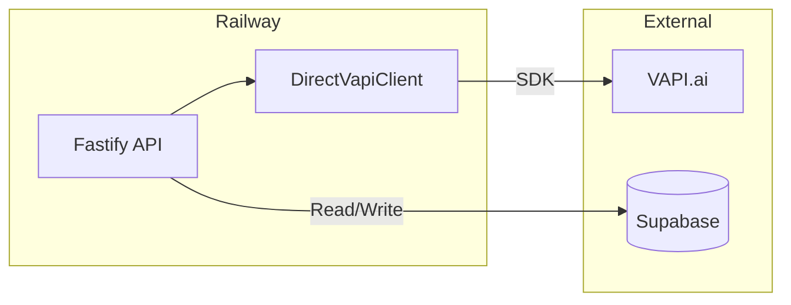

**Configuration:**

```bash
KESTRA_ENABLED=false
VAPI_API_KEY=your-prod-key
VAPI_PHONE_NUMBER_ID=your-prod-phone-id
```

### Local/Staging (With Kestra)

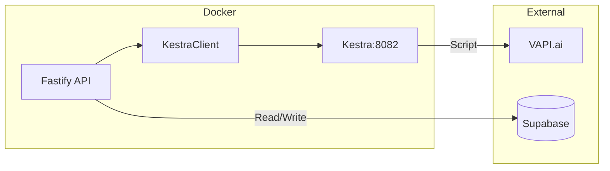

**Configuration:**

```bash
KESTRA_ENABLED=true
KESTRA_URL=http://localhost:8082
```
